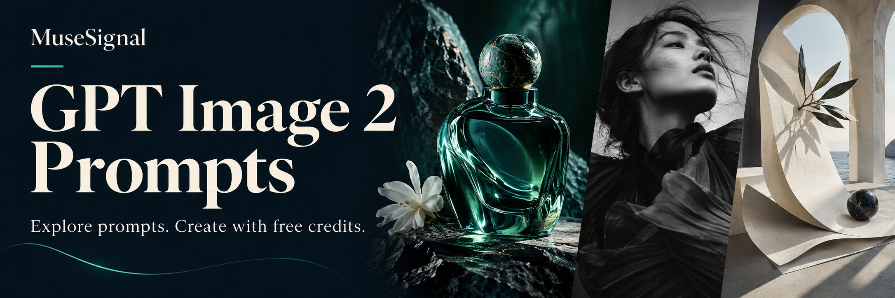

[](https://musesignal.com/?utm_source=github&utm_medium=repository&utm_campaign=awesome-gpt-image-2-prompts&utm_content=banner)

# Awesome GPT Image & GPT Image 2 Prompts

**by [MuseSignal](https://musesignal.com/?utm_source=github&utm_medium=repository&utm_campaign=awesome-gpt-image-2-prompts&utm_content=brand)**

[English](README.md) · [简体中文](README.zh-CN.md)

Complete prompts, real example images, original creators and sources. Curated by MuseSignal for product photography, portraits, posters and more.

**GPT Image · GPT Image 2**

> **Try leading AI image models — no top-up required to get started.**
>
> Sign up and claim free credits on MuseSignal. Generation uses credits; usage varies by model and settings.

**[Start creating with free credits](<https://musesignal.com/?utm_source=github&utm_medium=repository&utm_campaign=awesome-gpt-image-2-prompts&utm_content=hero>) · [Explore selected prompts ↓](<#selected-prompts>)**

| Public prompts in this repository | Complete examples on this page | Dataset updated |
| ---: | ---: | --- |
| **371** | **60** | 2026-09-24 |

This repository shares a selection from MuseSignal. The counts distinguish JSON records from examples on this page, not the full website library. Model collections are subsets of the catalog.

## Browse by use case

Open a filtered MuseSignal gallery. Counts refer to this repository's JSON; model collections offer separate version filters.

| Browse by use case | In JSON | MuseSignal |
| --- | ---: | --- |
| Portrait | 82 | [GPT Image](<https://musesignal.com/?category=portrait&model=gpt-image&utm_source=github&utm_medium=repository&utm_campaign=awesome-gpt-image-2-prompts&utm_content=category_portrait>) · [GPT Image 2](<https://musesignal.com/?category=portrait&model=gpt-image-2&utm_source=github&utm_medium=repository&utm_campaign=awesome-gpt-image-2-prompts&utm_content=category_portrait>) |
| Commercial &amp; Product | 83 | [GPT Image](<https://musesignal.com/?category=commercial-product&model=gpt-image&utm_source=github&utm_medium=repository&utm_campaign=awesome-gpt-image-2-prompts&utm_content=category_commercial-product>) · [GPT Image 2](<https://musesignal.com/?category=commercial-product&model=gpt-image-2&utm_source=github&utm_medium=repository&utm_campaign=awesome-gpt-image-2-prompts&utm_content=category_commercial-product>) |
| Poster &amp; Graphic | 82 | [GPT Image](<https://musesignal.com/?category=poster-graphic&model=gpt-image&utm_source=github&utm_medium=repository&utm_campaign=awesome-gpt-image-2-prompts&utm_content=category_poster-graphic>) · [GPT Image 2](<https://musesignal.com/?category=poster-graphic&model=gpt-image-2&utm_source=github&utm_medium=repository&utm_campaign=awesome-gpt-image-2-prompts&utm_content=category_poster-graphic>) |
| Food &amp; Drink | 13 | [GPT Image](<https://musesignal.com/?category=food-drink&model=gpt-image&utm_source=github&utm_medium=repository&utm_campaign=awesome-gpt-image-2-prompts&utm_content=category_food-drink>) · [GPT Image 2](<https://musesignal.com/?category=food-drink&model=gpt-image-2&utm_source=github&utm_medium=repository&utm_campaign=awesome-gpt-image-2-prompts&utm_content=category_food-drink>) |
| Character &amp; Art | 81 | [GPT Image](<https://musesignal.com/?category=character-art&model=gpt-image&utm_source=github&utm_medium=repository&utm_campaign=awesome-gpt-image-2-prompts&utm_content=category_character-art>) · [GPT Image 2](<https://musesignal.com/?category=character-art&model=gpt-image-2&utm_source=github&utm_medium=repository&utm_campaign=awesome-gpt-image-2-prompts&utm_content=category_character-art>) |
| Scene &amp; Space | 30 | [GPT Image](<https://musesignal.com/?category=scene-space&model=gpt-image&utm_source=github&utm_medium=repository&utm_campaign=awesome-gpt-image-2-prompts&utm_content=category_scene-space>) · [GPT Image 2](<https://musesignal.com/?category=scene-space&model=gpt-image-2&utm_source=github&utm_medium=repository&utm_campaign=awesome-gpt-image-2-prompts&utm_content=category_scene-space>) |

<a id="selected-prompts"></a>

## Selected prompts: examples & complete text

[Portrait](<#selected-portrait>) · [Commercial &amp; Product](<#selected-commercial-product>) · [Poster &amp; Graphic](<#selected-poster-graphic>) · [Food &amp; Drink](<#selected-food-drink>) · [Character &amp; Art](<#selected-character-art>) · [Scene &amp; Space](<#selected-scene-space>)

Expand Full prompt to copy the original text. Try on MuseSignal opens the case; use its prompt action to open the creation workspace. Images are the original creators’ examples, and model versions retain their source attribution.

<a id="selected-portrait"></a>

### Portrait · 10

[GPT Image](<https://musesignal.com/?category=portrait&model=gpt-image&utm_source=github&utm_medium=repository&utm_campaign=awesome-gpt-image-2-prompts&utm_content=category_portrait>) · [GPT Image 2](<https://musesignal.com/?category=portrait&model=gpt-image-2&utm_source=github&utm_medium=repository&utm_campaign=awesome-gpt-image-2-prompts&utm_content=category_portrait>)

<a id="prompt-50114a08-4de1-4e5c-8df1-fa5ed862fa2e"></a>

#### Minimalist Fashion Portrait with Cool Gaze

<a href="https://musesignal.com/prompt/50114a08-4de1-4e5c-8df1-fa5ed862fa2e?utm_source=github&amp;utm_medium=repository&amp;utm_campaign=awesome-gpt-image-2-prompts&amp;utm_content=case_image"></a>

**GPT Image 2** · Creator: serein

Use case: Portrait

<details>
<summary>Full prompt</summary>

```text
使用上传人物照片作为人像参考，保留人物的五官比例、脸型轮廓、眼神气质、发型特征与整体辨识度，不要生成陌生人脸，不要过度美颜，不要塑料皮肤。

生成一张高端极简时尚杂志封面海报，画面为竖版 3:4 或 9:16 构图。主体是一位成年东方女性，长黑发，自然微乱发丝，清冷温柔的眼神，淡妆，气质高级安静。

人物坐在深黑色极简长凳上，身体微微侧坐，双腿自然交叠并向前延伸，一只手轻轻扶在脸侧或头发旁，另一只手自然撑在座椅或放在腿上。姿态优雅松弛，有高级时装大片的从容感。

服装为黑色高级定制感西装外套裙，剪裁利落，肩线挺括，深色内搭，搭配黑色丝袜与黑色尖头高跟鞋。整体造型冷淡、克制、精致，不要夸张性感，不要低俗。

背景为浅灰白色极简摄影棚，干净留白，柔和棚拍灯光，轻微胶片颗粒质感，暗部细节丰富，整体色调为黑、灰、米白，画面高级、安静、有杂志封面感。

加入英文高级排版，不要中文。左侧使用大号竖排衬线字体标题：
SERENE
ELEGANCE

右上角小字：
2026
NEW COLLECTION

左下角小字：
BEAUTY
IS POWER
ELEGANCE
IS ATTITUDE

右下角小字：
SPRING / SUMMER
2026 COLLECTION

英文排版要简洁、高级、留白充足，不遮挡人物脸部和身体主体。整体风格参考高端时尚杂志封面、极简摄影棚人像、黑色西装女性大片、冷淡优雅广告海报。高清细节，真实皮肤质感，真实人体比例，优雅自然的手部和腿部结构。
```

</details>

**[Try on MuseSignal →](<https://musesignal.com/prompt/50114a08-4de1-4e5c-8df1-fa5ed862fa2e?utm_source=github&utm_medium=repository&utm_campaign=awesome-gpt-image-2-prompts&utm_content=readme_case_cta>)** · [Original post](<https://x.com/you1873118/status/2067166621253476463>)

---

<a id="prompt-62bd44c9-5d50-4c07-804f-33e8f1a2af60"></a>

#### 3D Realistic Portraits of China&#39;s Founding Pillars

<a href="https://musesignal.com/prompt/62bd44c9-5d50-4c07-804f-33e8f1a2af60?utm_source=github&amp;utm_medium=repository&amp;utm_campaign=awesome-gpt-image-2-prompts&amp;utm_content=case_image"></a>

**GPT Image 2** · Creator: Larus Canus

Use case: Portrait

<details>
<summary>Full prompt</summary>

```text
请创作一张竖版 3:4「现代人物3D立像档案海报」。

主题人物：【人物姓名】
人物身份：【科学家 / 企业家 / 艺术家 / 作家 / 教育家 / 医学家等】
核心成就：【一句话概括他/她改变了什么】
代表道具：【最能代表这个人物的物品】
主色调：【根据人物领域选择，例如金黄稻田 / 科技蓝 / 戈壁灰 / 医学青绿等】

画面中央是一位高度写实的现实主义人物主视觉，人物要像真实站在镜头前，具有纪实摄影质感、电影级光影、真实皮肤纹理、真实服装材质和清晰面部细节。

人物一只手将【代表道具】朝镜头前伸，形成强烈近大远小、破框而出的 3D 视觉冲击。道具必须完整可见、清晰真实、有材质细节，不能被裁切，不能变形，不能糊掉。

四周加入 6-8 个轻质悬浮的信息切片，每个切片包含关键年份、事件标题、小图像和简短说明，用来呈现人物的重要经历、代表成就和时代影响。信息切片要半透明、轻盈、有细线连接，不要厚重卡片感，不要喧宾夺主。

左侧设置人物大标题【人物姓名】，搭配身份说明和一句简短精神概括。底部设置一条轻量时间轴，串联人物一生的重要节点，使用细线、小圆点和简洁年份，不要做成厚重底栏。

整体风格：现实主义人物摄影 + 电影海报 + 人物传记档案 + 现代信息设计。
重点：人物要真实，道具要冲出来，信息要轻，时间线要清楚。
```

</details>

**[Try on MuseSignal →](<https://musesignal.com/prompt/62bd44c9-5d50-4c07-804f-33e8f1a2af60?utm_source=github&utm_medium=repository&utm_campaign=awesome-gpt-image-2-prompts&utm_content=readme_case_cta>)** · [Original post](<https://x.com/MrLarus/status/2069070973018550356>)

---

<a id="prompt-a5af9c91-fa00-4445-a905-1fa900e0d876"></a>

#### Low Angle Portrait of a Woman in Silk

<a href="https://musesignal.com/prompt/a5af9c91-fa00-4445-a905-1fa900e0d876?utm_source=github&amp;utm_medium=repository&amp;utm_campaign=awesome-gpt-image-2-prompts&amp;utm_content=case_image"></a>

**GPT Image 2** · Creator: こやす69＠AIプロンプト屋

Use case: Portrait

<details>
<summary>Full prompt</summary>

```text
A highly realistic photo of an adult East Asian woman in her early 20s, photographed from a dramatic low angle looking upward. She has a natural, elegant face, soft clear skin, light natural makeup, slightly tousled long dark brown hair, and a calm, subtly alluring expression while looking down toward the camera.
She is wearing a loose white silk shirt instead of a knit top. The shirt is lightweight, glossy, soft, and fluid, with a luxurious silk texture. She gently lifts and opens the hem of the white silk shirt with both hands, creating a flowing curve of fabric across the frame. The shirt catches the sunlight beautifully, showing delicate highlights, soft folds, and a refined semi-sheer quality. Her lower body is styled with relaxed white drawstring lounge pants.
Composition: extreme low-angle shot from around waist level, camera pointing upward toward her face and torso. The midriff is visible, with the fabric stretched lightly between her hands. Her face appears near the top of the frame, while the torso and silk shirt dominate the foreground. Vertical composition, intimate fashion editorial framing.
Lighting: strong natural sunlight streaming in from a window above and behind her, creating radiant sunbeams and scattered dappled light patterns across her skin, shirt, and the scene. Bright backlighting, glowing rim light on the hair, warm highlights, soft shadows, airy and luminous mood.
Background: minimal bright interior near a window, clean modern room, soft pale walls, morning or afternoon sunlight flooding the space. The environment should feel quiet, warm, and serene.
Style: ultra-realistic fashion photograph, cinematic sunlight, natural skin texture, premium editorial aesthetic, soft and airy mood, high detail, realistic color grading, elegant and sensual without explicit nudity, 4K quality.
Important details: white silk shirt, not knit, loose and glossy fabric, sunlight passing through and reflecting on the material, visible soft folds, low-angle perspective, luminous atmosphere, adult subject only.
```

</details>

**[Try on MuseSignal →](<https://musesignal.com/prompt/a5af9c91-fa00-4445-a905-1fa900e0d876?utm_source=github&utm_medium=repository&utm_campaign=awesome-gpt-image-2-prompts&utm_content=readme_case_cta>)** · [Original post](<https://x.com/AI_money_club/status/2067731526448738460>)

---

<a id="prompt-1ea1c1e0-71ab-4674-bd76-9d500544b282"></a>

#### Stadium Supporter in World Cup Crowd

<a href="https://musesignal.com/prompt/1ea1c1e0-71ab-4674-bd76-9d500544b282?utm_source=github&amp;utm_medium=repository&amp;utm_campaign=awesome-gpt-image-2-prompts&amp;utm_content=case_image"></a>

**GPT Image 2** · Creator: Eesha

Use case: Portrait

<details>
<summary>Full prompt</summary>

```text
16:9 ultra-realistic live World Cup broadcast crowd cutaway inside a packed football stadium. Beautiful elegant female supporter wearing a [COUNTRY-COLOR] football jersey and scarf, naturally watching the match from the stands, not looking at the camera, not posing, not waving. Medium crowd shot (waist-up), surrounded by passionate fans, authentic stadium atmosphere. Realistic floodlights, telephoto sports lens, shallow depth of field, cinematic realism, natural skin texture, premium 4K TV broadcast quality.
Top-left scoreboard: [MATCH TIME] [TEAM A] [SCORE]-[SCORE] [TEAM B]
Top-right live bug: WC LIVE 1
Avoid: eye contact, posing, waving, anime, illustration, plastic skin, extreme close-up, empty background, official logos, distorted faces, fake crowd, messy graphics.
```

</details>

**[Try on MuseSignal →](<https://musesignal.com/prompt/1ea1c1e0-71ab-4674-bd76-9d500544b282?utm_source=github&utm_medium=repository&utm_campaign=awesome-gpt-image-2-prompts&utm_content=readme_case_cta>)** · [Original post](<https://x.com/MissDelulu9/status/2064553143288172582>)

---

<a id="prompt-494fcfc3-aa56-41e8-b043-20ccf3c077e7"></a>

#### Exaggerated Anime Character in Distant Shot

<a href="https://musesignal.com/prompt/494fcfc3-aa56-41e8-b043-20ccf3c077e7?utm_source=github&amp;utm_medium=repository&amp;utm_campaign=awesome-gpt-image-2-prompts&amp;utm_content=case_image"></a>

**GPT Image 2** · Creator: BubbleBrain

Use case: Portrait

<details>
<summary>Full prompt</summary>

```text
Photorealistic Japanese gal fashion portrait, soft CCD flash aesthetic, strong HDF highlight bloom, vertical 9:16 composition, close-up three-quarter body portrait, eye-level intimate camera distance, cinematic Japanese photobook mood.

A beautiful young adult Chinese internet celebrity woman in her mid-20s, standing very close to the camera. The framing is tighter than a full-body shot, from upper thighs / waist-up to head, making her face large and clearly visible. She has a fuller curvy feminine figure, pronounced S-shaped body curve, defined waist, elegant waist-to-hip contour, fuller bust and hips, long slender legs, realistic anatomy, visible collarbones, natural skin texture, fair porcelain skin, luminous smooth highlights, and a confident bold presence.

She has long slightly tousled dark brown hair with soft messy volume, loose strands framing her face, glossy lips, delicate Japanese gal eye makeup, subtle blush, thin eyeliner, small hoop earrings, and a fashionable gyaru-inspired beauty look.

Expression: she is making a clearly readable angry-cute “😠” expression. Her eyebrows are slightly furrowed and pulled inward, her eyes are subtly narrowed with intense direct eye contact, her lips are softly pouting and pushed forward a little, her cheeks are faintly tightened, and her face shows an annoyed, jealous, sulky, playful girlfriend mood. The expression should feel realistic, stylish, cute, irritated, and slightly confrontational, not cartoonish, not exaggerated.

Outfit: fashionable Japanese gal / spicy streetwear outfit, fitted cropped black leather jacket, tight white ribbed crop top, low-rise fitted denim mini skirt with decorative chain belt, glossy white sheer pantyhose with pearlescent shine, slim waist chain, delicate necklace, small white handbag, and glossy white platform ankle boots. The styling should feel bold, trendy, feminine, sexy but tasteful, non-explicit, fashion-forward, and flattering to her S-shaped curve.

Pose: standing close to the camera with one hip pushed to the side to emphasize the S-curve, upper body subtly leaning toward the camera, one hand on her waist, the other hand lightly pulling the jacket collar or holding the handbag strap near her shoulder. Her posture feels confident, annoyed, stylish, and slightly confrontational, like a late-night fashion magazine snapshot with attitude.

Scene: late-night Japanese city street outside a small boutique hotel or convenience store, wet pavement reflecting neon lights, vending machine glow, distant taxi lights, soft urban background blur, subtle signage, quiet private nighttime atmosphere, cinematic street-fashion realism.

Lighting and aesthetic: very soft CCD flash lighting on the subject, dreamy highlight bloom, strong HDF-like halation, glowing overexposed highlights on skin, hair edges, pantyhose, leather jacket, and metal accessories. Warm neon reflections mixed with cool night ambience, soft haze, smooth tonal transitions, luminous fair skin, glossy texture, realistic shadows, natural lighting falloff, realistic hair strands, subtle pores and natural skin detail, clean polished photorealistic image quality. The image should feel soft, glowing, cinematic, and highly realistic, with no harsh digital sharpness.

Mood: stylish, sulky, cute-angry, confident, intimate, fashionable, glamorous, late-night Japanese street romance, soft but powerful feminine energy, cinematic realistic fashion editorial.

Negative prompt: full-body distant shot, face too small, unclear expression, neutral expression, smiling, cartoon anger, exaggerated anime face, extra fingers, distorted hands, unrealistic anatomy, bad proportions, deformed feet, awkward pose, plastic skin, waxy skin, explicit nudity, vulgar styling, blurry face, low quality, harsh digital sharpness, heavy noise, gritty texture, visible film grain.
```

</details>

**[Try on MuseSignal →](<https://musesignal.com/prompt/494fcfc3-aa56-41e8-b043-20ccf3c077e7?utm_source=github&utm_medium=repository&utm_campaign=awesome-gpt-image-2-prompts&utm_content=readme_case_cta>)** · [Original post](<https://x.com/BubbleBrain/status/2065815868349849630>)

---

<a id="prompt-9556eb39-e9aa-4482-a6aa-3b74f68fbf34"></a>

#### Luxury Chaebol Heiress Portrait

<a href="https://musesignal.com/prompt/9556eb39-e9aa-4482-a6aa-3b74f68fbf34?utm_source=github&amp;utm_medium=repository&amp;utm_campaign=awesome-gpt-image-2-prompts&amp;utm_content=case_image"></a>

**GPT Image 2** · Creator: BubbleBrain

Use case: Portrait

<details>
<summary>Full prompt</summary>

```text
Photorealistic luxury indoor portrait, Korean chaebol heiress mood, film photography aesthetic, strong highlight bloom, soft halation, subtle grain, slightly overexposed highlights, cold luxurious atmosphere, vertical 9:16 composition.
A beautiful young Chinese Internet Celebrity with a refined Korean V-line face, luminous fair skin, realistic skin texture, and a naturally fuller curvy figure with a soft S-shaped silhouette, fuller bust, defined waist, and long graceful legs. She wears cold elegant chaebol-heiress makeup: clean matte-dewy base, softly defined brows, subtle cool-toned eye makeup, clear lashes, faint blush, and muted rose-brown glossy lips. Long slightly tousled dark hair, delicate earrings.
Outfit: luxury at-home loungewear, elegant and tasteful, such as a soft ivory or champagne satin camisole with a loose knit cardigan or silky robe, paired with refined short lounge bottoms, creating a relaxed but expensive private-luxury feeling.
Scene: ultra-luxury penthouse living room at night, soft carpet floor, designer sofa nearby, dim ambient lighting, dark glass windows, subtle city lights in the background, polished interior, quiet wealthy private-night atmosphere.
Pose: squatting / crouched seated on the floor, facing the camera directly, body slightly tucked in naturally, one arm resting lightly on her knee, the other hand relaxed on the floor, both legs folded elegantly to emphasize curves and leg length. Expression: calm, distant, slightly tired and half-tipsy, half-lucid, looking straight into the camera.
Style: low-saturation navy obsidian mood, cold-toned luxury, film highlight bloom, rich-girl private snapshot, elegant, refined, non-explicit.
```

</details>

**[Try on MuseSignal →](<https://musesignal.com/prompt/9556eb39-e9aa-4482-a6aa-3b74f68fbf34?utm_source=github&utm_medium=repository&utm_campaign=awesome-gpt-image-2-prompts&utm_content=readme_case_cta>)** · [Original post](<https://x.com/BubbleBrain/status/2067158519477059762>)

---

<a id="prompt-54d12f98-a00c-41f1-9472-81c1edb695cc"></a>

#### Warm Candid Portrait on a Couch

<a href="https://musesignal.com/prompt/54d12f98-a00c-41f1-9472-81c1edb695cc?utm_source=github&amp;utm_medium=repository&amp;utm_campaign=awesome-gpt-image-2-prompts&amp;utm_content=case_image"></a>

**GPT Image 2** · Creator: John

Use case: Portrait

<details>
<summary>Full prompt</summary>

```text
A warm 35mm film photograph shot from a low-left oblique angle, capturing the full upper body of a young East Asian woman in her early 20s from the side. She is slumped sideways into a dark fabric couch, her back and left shoulder pressed against an olive-green cushion, left arm draped loosely over the couch back behind her. Her right knee is bent and raised just slightly into the lower-left corner of the frame — barely visible, mostly cropped — with her right hand resting lightly on that knee. Her left leg extends down naturally off the couch, separated from the right. The composition centers on her torso and face seen from the side, showing the full line of her body from hip to shoulder. She has short, tousled black hair falling messily around her jaw, a few strands across her forehead. Her head is tilted slightly downward and turned toward the camera, cheeks and ears blushing a warm pink, and she looks directly into the lens with half-lidded eyes and a small, knowing smirk — playful, slightly mischievous, the kind of look that says she knows exactly what she is doing. She wears a white ribbed camisole with thin spaghetti straps and delicate lace trim along the neckline, a tiny gold pendant necklace, and loose beige cotton drawstring shorts sitting low on her hips with a sliver of stomach showing. On a small round wooden side table at the right edge of the frame sits a rocks glass of whiskey with ice and a small bowl of nuts. Dimly lit room at night, a warm floor lamp glowing in the background right, golden light wrapping along the right side of her body and highlighting her shoulder and cheek while the left falls into soft shadow. Shallow depth of field, background dissolving into warm dark bokeh with faint framed pictures on the wall. Kodak Portra 800, visible film grain, warm amber palette, intimate candid atmosphere.
```

</details>

**[Try on MuseSignal →](<https://musesignal.com/prompt/54d12f98-a00c-41f1-9472-81c1edb695cc?utm_source=github&utm_medium=repository&utm_campaign=awesome-gpt-image-2-prompts&utm_content=readme_case_cta>)** · [Original post](<https://x.com/johnAGI168/status/2066893593583788388>)

---

<a id="prompt-1f691c4a-a2d0-4176-8a54-e325d7fcd481"></a>

#### Passionate Portugal Fan in the Stadium

<a href="https://musesignal.com/prompt/1f691c4a-a2d0-4176-8a54-e325d7fcd481?utm_source=github&amp;utm_medium=repository&amp;utm_campaign=awesome-gpt-image-2-prompts&amp;utm_content=case_image"></a>

**GPT Image 2** · Creator: Johnn

Use case: Portrait

<details>
<summary>Full prompt</summary>

```text
Create an ultra-photorealistic candid stadium photograph of a handsome young man in his early-to-mid 20s who is a passionate Portugal football supporter during a FIFA World Cup match.
The image is photographed by someone else (not a selfie).
Composition:
Vertical 4:5 framing
Camera positioned a few feet away from him
Body visible from head to just below the knees
He occupies about 40% of the frame
The football pitch and active players are clearly visible below and behind him
Large stadium atmosphere surrounding him
Shot from high up in the stands
Appearance:
Young Portuguese/Mediterranean-looking man
Athletic build with broad shoulders
Strong jawline
Short textured dark hair
Light stubble
Natural skin texture with realistic pores
Authentic facial proportions
Calm but confident expression
Outfit:
Portugal national team red jersey
Matching green Portugal shorts
White crew socks
White sneakers
Small silver chain necklace
Minimal accessories
Pose:
Standing casually beside the concrete railing in the upper stands
One forearm resting on the barrier
Other hand casually tucked into the shorts pocket
Body angled about 30 degrees away from the camera
Looking down toward the match instead of at the camera
Relaxed shoulders
Strong, athletic posture
Natural candid fan moment
Environment:
Packed football stadium at night
Thousands of Portugal supporters wearing red and green
Large Portuguese flags throughout the crowd
Bright stadium floodlights
Green football pitch clearly visible below
Tiny players actively playing on the field
Immersive FIFA World Cup atmosphere
Upper-tier spectator viewpoint
Photography Style:
Realistic telephoto candid photography
50mm lens
Professional sports event photography
Ultra-detailed fabric textures
Natural skin rendering
Cinematic realism
Documentary-style composition
High dynamic range
Premium commercial quality
Social-media-worthy football fan photograph
Mood: Proud Portugal supporter, energetic, adventurous, confident, immersive match-day experience, football culture.
Keywords: FIFA World Cup 2026, Portugal fan, Cristiano Ronaldo energy, football culture, match day atmosphere, stadium experience, Portugal national team, football supporter.
Negative Prompt:
selfie, phone visible, direct eye contact, awkward anatomy, extra fingers, extra limbs, anime, illustration, CGI, beauty filters, plastic skin, empty stadium, blurred players, watermark, text, logo, duplicate person, unrealistic crowd, poor lighting, cartoon style.
```

</details>

**[Try on MuseSignal →](<https://musesignal.com/prompt/1f691c4a-a2d0-4176-8a54-e325d7fcd481?utm_source=github&utm_medium=repository&utm_campaign=awesome-gpt-image-2-prompts&utm_content=readme_case_cta>)** · [Original post](<https://x.com/john_my07/status/2067642906035585315>)

---

<a id="prompt-d3f6b406-8198-4410-9e13-b0593cb98ac7"></a>

#### Candid Street Portrait in Natural Light

<a href="https://musesignal.com/prompt/d3f6b406-8198-4410-9e13-b0593cb98ac7?utm_source=github&amp;utm_medium=repository&amp;utm_campaign=awesome-gpt-image-2-prompts&amp;utm_content=case_image"></a>

**GPT Image 2** · Creator: Mira

Use case: Portrait

<details>
<summary>Full prompt</summary>

```text
Ultra-realistic candid street portrait of a beautiful young woman with naturally textured skin, minimal makeup, soft facial features, deep brown eyes, and long slightly messy dark hair, standing outside a modern café in daylight. She wears an oversized dark charcoal sweatshirt, loose white pants, and a black shoulder tote bag. Slight natural side pose with her body turned softly away from camera while face looks slightly sideways, relaxed hands in pockets, calm expression, authentic human look, no AI beauty filter, no artificial skin smoothing, realistic imperfections, cinematic natural lighting, shallow depth of field, urban reflections on glass windows, casual lifestyle photography, iPhone 15 Pro photo style, realistic shadows, cozy café atmosphere, highly detailed, photorealistic, 4K.
```

</details>

**[Try on MuseSignal →](<https://musesignal.com/prompt/d3f6b406-8198-4410-9e13-b0593cb98ac7?utm_source=github&utm_medium=repository&utm_campaign=awesome-gpt-image-2-prompts&utm_content=readme_case_cta>)** · [Original post](<https://x.com/miratechtool/status/2062398444346438060>)

---

<a id="prompt-f606725d-5ba0-4fed-94fe-4f1fbc09b3e0"></a>

#### Effortless Street-Style Elegance in Summer Sun

<a href="https://musesignal.com/prompt/f606725d-5ba0-4fed-94fe-4f1fbc09b3e0?utm_source=github&amp;utm_medium=repository&amp;utm_campaign=awesome-gpt-image-2-prompts&amp;utm_content=case_image"></a>

**GPT Image 2** · Creator: Simply Ray

Use case: Portrait

<details>
<summary>Full prompt</summary>

```text
A high-end fashion magazine cover titled "VANTAGE" in a bold, black, minimalist sans-serif font across the top. The subtext reads "SUMMER EDITION" on the left and "2024" on the right.
The central subject is a stylish young woman with long, voluminous wavy hair, wearing a black baseball cap, oversized designer sunglasses, an oversized light-blue short-sleeved button-down shirt loosely tucked into baggy black jeans, a slim black tie, and chunky fashion sneakers. She leans confidently against an off-white concrete wall under bright summer sunlight, exuding effortless street-style elegance and modern fashion-editorial energy.
Flanking her on both sides are multiple heavily motion-blurred silhouettes of the same woman walking past, creating a striking sense of speed, movement, and urban rhythm. The blurred figures maintain the same outfit and hairstyle while remaining intentionally indistinct.
In the bottom left corner, sleek editorial typography reads:
"STREET REFINED: THE NEW CODE OF STYLE"
"MOTION CULTURE: MOVING FAST. LOOKING SHARP."
"SUMMER STATE OF MIND: LIGHTER DAYS. BOLDER MOVES."
Luxury fashion magazine aesthetic, realistic editorial photography, Vogue-quality cover design, sharp focus on the central subject, dynamic motion blur on the sides, high-contrast sunlight, crisp shadows, premium color grading, cinematic composition, urban sophistication, contemporary street fashion, photorealistic 8K, professional fashion photography, magazine-cover masterpiece.
```

</details>

**[Try on MuseSignal →](<https://musesignal.com/prompt/f606725d-5ba0-4fed-94fe-4f1fbc09b3e0?utm_source=github&utm_medium=repository&utm_campaign=awesome-gpt-image-2-prompts&utm_content=readme_case_cta>)** · [Original post](<https://x.com/simplyfutureai/status/2066480589809856717>)

---

<a id="selected-commercial-product"></a>

### Commercial &amp; Product · 13

[GPT Image](<https://musesignal.com/?category=commercial-product&model=gpt-image&utm_source=github&utm_medium=repository&utm_campaign=awesome-gpt-image-2-prompts&utm_content=category_commercial-product>) · [GPT Image 2](<https://musesignal.com/?category=commercial-product&model=gpt-image-2&utm_source=github&utm_medium=repository&utm_campaign=awesome-gpt-image-2-prompts&utm_content=category_commercial-product>)

<a id="prompt-1d5e09a2-bb8d-4c9d-bdca-b9d0310b08d1"></a>

#### 云栖天境：城市封面湖居公园广告

<a href="https://musesignal.com/prompt/1d5e09a2-bb8d-4c9d-bdca-b9d0310b08d1?utm_source=github&amp;utm_medium=repository&amp;utm_campaign=awesome-gpt-image-2-prompts&amp;utm_content=case_image"></a>

**GPT Image 2** · Creator: Larus Canus

Use case: Commercial &amp; Product

<details>
<summary>Full prompt</summary>

```text
请生成一张【高端地产超宽横幅广告】，单张图片，不要拼图，不要多宫格。
尺寸：横版 3:1，约 2109×745 像素，适合楼盘围挡、户外大牌、售楼部物料、地产项目价值点海报。
【项目名称】：云栖天境
【主标题】：填写一句高级地产广告标题
【副标题】：填写一句项目价值说明
【核心卖点】：城市封面 / 湖居公园 / 教育配套 / 户型舒居 / 商业配套 / 山景资源
【主视觉】：建筑立面 / 城市天际线 / 湖面公园 / 校园操场 / 室内样板间 / 社区景观
【主色调】：米白、雾蓝、浅灰、淡青绿、香槟金，低饱和高级配色
整体风格为高端地产广告、商业提案 KV、现代东方极简、轻奢克制、大面积留白、低饱和色彩、真实商业物料质感。
画面采用超宽横向构图，主标题作为第一视觉中心，主视觉场景作为第二视觉中心，底部保留一条细长信息栏，用于放置项目名、面积段、热线电话、区域信息等。
主视觉不要简单贴图，要有设计感：可以通过半透明玻璃面、弧形空间窗口、流体曲线、纸张折页、浅金细线、极淡网格、建筑线稿、等高线纹理、水波线条等元素，把建筑、景观或空间包装成高端地产提案视觉。
文字排版要克制高级：中文大标题疏朗，副标题细小，英文小字点缀，信息栏轻薄，不要文字堆满。整体像真实地产围挡广告 / 售楼部主视觉 / 户外横幅 KV。
避免：普通促销海报、低端楼盘传单、红金土豪风、杂乱拼贴、信息过多、过度饱和、廉价模板感、图片生硬贴上去、文字拥挤、卡通感、低清晰度。
```

</details>

**[Try on MuseSignal →](<https://musesignal.com/prompt/1d5e09a2-bb8d-4c9d-bdca-b9d0310b08d1?utm_source=github&utm_medium=repository&utm_campaign=awesome-gpt-image-2-prompts&utm_content=readme_case_cta>)** · [Original post](<https://x.com/MrLarus/status/2067562275666334068>)

---

<a id="prompt-514ec371-bc9c-4ebe-9bf6-f61d42fa9183"></a>

#### DUNE Sneaker Poster: Walk with Confidence

<a href="https://musesignal.com/prompt/514ec371-bc9c-4ebe-9bf6-f61d42fa9183?utm_source=github&amp;utm_medium=repository&amp;utm_campaign=awesome-gpt-image-2-prompts&amp;utm_content=case_image"></a>

**GPT Image 2** · Creator: Ozair AI

Use case: Commercial &amp; Product

<details>
<summary>Full prompt</summary>

```text
A warm editorial vertical lifestyle sneaker poster (9:16 ratio).
A young American white man with sharp jawline and defined facial features,
wearing oversized cream linen pants and a beige crewneck, casually mid-stride
with one foot forward — shot from below at a low ground-level angle,
confident and relaxed energy. Large earthy bold typography "WALK" in terracotta
brown behind the figure. Brand name "DUNE" at the bottom. Taglines:
"SLOW DOWN TO STAND OUT." / "MADE FOR THE JOURNEY." Sand-colored suede sneakers
with terracotta sole in sharp foreground. Warm sandy gradient background with
subtle dust particle atmosphere. Ultra photorealistic, 8K, no text overlays
on subject, cinematic color grading."
```

</details>

**[Try on MuseSignal →](<https://musesignal.com/prompt/514ec371-bc9c-4ebe-9bf6-f61d42fa9183?utm_source=github&utm_medium=repository&utm_campaign=awesome-gpt-image-2-prompts&utm_content=readme_case_cta>)** · [Original post](<https://x.com/Ozayrr_irl/status/2050214923100368911>)

---

<a id="prompt-4385109c-9158-4893-bf7b-99d65113f089"></a>

#### Dancer on SUV in Snowy Mountains

<a href="https://musesignal.com/prompt/4385109c-9158-4893-bf7b-99d65113f089?utm_source=github&amp;utm_medium=repository&amp;utm_campaign=awesome-gpt-image-2-prompts&amp;utm_content=case_image"></a>

**GPT Image 2** · Creator: Sairah

Use case: Commercial &amp; Product

<details>
<summary>Full prompt</summary>

```text
"A wide, cinematic shot of a young woman with long dark hair, wearing a grey New York Yankees baseball cap, a grey cropped knit sweater, and matching grey sweatpants. She is confidently performing fluid, rhythmic dance movements while standing on the roof of a dark grey SUV. The setting is a majestic, snowy mountain range with jagged, snow-capped peaks in the background under a moody, overcast sky. The atmosphere is serene and cool-toned, with high-quality, professional photography style."
Prompt Breakdown
To get the best result if you are tweaking this for a specific tool, consider these key elements captured in the video:
Subject: Woman, long dark hair, wearing a New York Yankees cap, grey cropped knit sweater, matching grey sweatpants.
Action: Rhythmic, slow, fluid dancing.
Setting: High-altitude, snowy mountain landscape, epic scenery.
Object: Standing on the roof of a dark grey modern SUV.
Cinematography: Wide-angle, cinematic lifestyle photography, cool color grading, moody daylight.
```

</details>

**[Try on MuseSignal →](<https://musesignal.com/prompt/4385109c-9158-4893-bf7b-99d65113f089?utm_source=github&utm_medium=repository&utm_campaign=awesome-gpt-image-2-prompts&utm_content=readme_case_cta>)** · [Original post](<https://x.com/Sairah_0/status/2066431422098018496>)

---

<a id="prompt-31930789-95e4-4271-93d1-6904946588e9"></a>

#### Midnight Blue Lace Lingerie E-Commerce Atmosphere

<a href="https://musesignal.com/prompt/31930789-95e4-4271-93d1-6904946588e9?utm_source=github&amp;utm_medium=repository&amp;utm_campaign=awesome-gpt-image-2-prompts&amp;utm_content=case_image"></a>

**GPT Image 2** · Creator: Larus Canus

Use case: Commercial &amp; Product

<details>
<summary>Full prompt</summary>

```text
【统一要求】
生成竖版9:16、2K高清电商详情页成交氛围图。整体风格为“红酒玫瑰夜”，主色：酒红、深红、黑色蕾丝、玫瑰金、暖肤色。画面高级、精致、有成交氛围，参考现有红色系列详情页风格，保持统一的暗红丝绒、玫瑰、金色线条、半透明深红信息框排版。所有文字必须为中文，清晰准确，不要英文、乱码、错字。人物必须是明确成年的中国女性模特，25-35岁，性感但高级，不裸露、不低俗。

负面要求：不要未成年人，不要校园制服，不要真实学校场景，不要裸露，不要色情，不要低俗姿势，不要英文，不要乱码，不要模糊，不要杂乱排版，不要廉价海报感。

【图1｜红酒玫瑰丝袜搭配图】
主题：红酒玫瑰丝袜搭配成交氛围图。
画面：成熟女性模特穿酒红蕾丝聚拢文胸和成套内裤，搭配透肤黑丝袜或酒红吊带丝袜，外披黑色蕾丝睡袍或酒红丝缎衬衫。背景为暗红丝绒沙发、复古镜面、玫瑰花、烛光暖光。重点突出腿部丝袜线条、酒红内衣、黑蕾丝边和轻熟约会氛围。
文字：
主标题：红酒玫瑰，氛围感更浓
副标题：酒红蕾丝配丝袜，轻熟又显型
卖点：酒红蕾丝文胸｜透肤黑丝袜｜玫瑰氛围感｜轻熟约会风
底部：显白｜显型｜显腿｜有氛围

【图2｜红黑蕾丝材质细节图】
主题：红黑蕾丝材质细节成交图。
画面：模特局部穿着展示，重点呈现肩颈、胸型、腰侧、酒红杯面、黑色蕾丝杯边、贴肤效果和承托感。加入4个精致放大细节框，分别展示：酒红杯面纹理、黑色蕾丝杯边、玫瑰金小吊坠与肩带五金、弹力下围。背景为暗红丝绒、玫瑰花瓣、暖光摄影棚。
文字：
主标题：红黑蕾丝，细节更显贵
副标题：柔软贴肤，精致不扎
卖点：细腻蕾丝｜酒红杯面｜玫瑰金吊坠｜弹力下围
底部：显白｜贴合｜承托｜久穿舒适

【图3｜背部与腰线展示图】
主题：背部与腰线展示成交图。
画面：模特背部到腰胯构图，穿酒红蕾丝文胸和成套内裤，半披黑色蕾丝睡袍或酒红丝缎衬衫，微侧身回眸或自然整理肩带。重点展示后背肩带、后扣、下围贴合、腰线、背部平整度。背景为暗红窗帘、复古镜面、玫瑰花、暖光。
文字：
主标题：背影也要显瘦显型
副标题：后背贴合，腰线更利落
卖点：肩带不滑｜后背平整｜下围贴合｜显腰不臃肿
底部：稳固｜贴合｜显腰｜精致

【图4｜红酒玫瑰产品平铺图】
主题：红酒玫瑰产品平铺成交图。
画面：无人物穿着，仅产品平铺。酒红蕾丝聚拢文胸、成套蕾丝内裤、透肤黑丝袜，摆放在暗红丝绒布或深咖皮质桌面上，搭配玫瑰、香水、珍珠、玫瑰金首饰、黑蕾丝手套或丝缎睡袍局部。要有高级礼盒感和品牌开箱感，产品完整清晰，蕾丝纹理、杯型、肩带、吊坠、丝袜质感都要可见。
文字：
主标题：一套红酒玫瑰夜
副标题：从内衣到丝袜，氛围完整
产品组合：酒红蕾丝文胸｜成套蕾丝内裤｜透肤黑丝袜｜玫瑰金点缀
风格卖点：轻熟性感｜显白提气色｜精致显型｜约会氛围感
```

</details>

**[Try on MuseSignal →](<https://musesignal.com/prompt/31930789-95e4-4271-93d1-6904946588e9?utm_source=github&utm_medium=repository&utm_campaign=awesome-gpt-image-2-prompts&utm_content=readme_case_cta>)** · [Original post](<https://x.com/MrLarus/status/2068009878702915648>)

---

<a id="prompt-30231560-9dab-4296-b2f2-ce59c3297517"></a>

#### MOVE DIFFERENT: New Balance 9060 Luxury Campaign

<a href="https://musesignal.com/prompt/30231560-9dab-4296-b2f2-ce59c3297517?utm_source=github&amp;utm_medium=repository&amp;utm_campaign=awesome-gpt-image-2-prompts&amp;utm_content=case_image"></a>

**GPT Image 2** · Creator: Hemayxn.ai

Use case: Commercial &amp; Product

<details>
<summary>Full prompt</summary>

```text
Create a hyper-realistic luxury footwear campaign poster for the New Balance 9060 titled:
"MOVE DIFFERENT."
IMPORTANT:
Do NOT create a traditional sneaker advertisement.
Do NOT imitate existing Nike campaign layouts.
Instead, create a bold fashion-meets-architecture campaign that celebrates the futuristic shape language of the New Balance 9060.
The shoe should feel less like footwear and more like a design object.
FORMAT:
Vertical premium poster.
Luxury editorial design.
Museum-quality product campaign.
Built for social media dominance.
MAIN SUBJECT:
A striking fashion-forward young adult captured mid-motion.
Not an athlete.
Not a runner.
A modern style icon.
Wardrobe:
oversized monochrome streetwear premium wide-leg trousers oversized bomber jacket minimalist accessories New Balance 9060 sneakers prominently featured
POSE:
Dynamic floating step.
The subject appears suspended between walking and levitating.
The movement should feel effortless.
The 9060 must remain the visual hero.
FOOTWEAR FOCUS:
Massively emphasize the sculptural qualities of the New Balance 9060:
exaggerated pod-like sole futuristic proportions layered materials suede texture mesh detailing premium craftsmanship
The sneaker should occupy a significant portion of the composition.
GRAPHIC CONCEPT:
Instead of giant typography in the background:
Create massive architectural forms inspired by the 9060 sole geometry.
Large flowing curves.
Layered shapes.
Futuristic structural elements.
These shapes emerge behind the subject like modern art installations.
Typography integrates into the architecture.
TYPOGRAPHY:
Massive condensed typography:
MOVE
DIFFERENT
The words stretch vertically across the composition.
Letters interact with the subject.
Parts hidden behind the figure.
Parts disappearing into architectural structures.
Additional micro typography:
"9060"
"DESIGNED FOR TOMORROW"
"FORM FOLLOWS MOTION"
"NB FUTURE SERIES"
"EST. 1906"
Include subtle blueprint-inspired annotations and technical callouts around the shoe.
COLOR PALETTE:
Choose one dominant colorway:
Option A: warm stone, cream, charcoal, silver.
Option B: soft sage green, off-white, graphite.
Option C: cool steel blue, light gray, black.
Keep everything premium and restrained.
LIGHTING:
Luxury fashion-editorial lighting.
Soft directional light.
Museum-grade product illumination.
Clean shadows.
Premium texture rendering.
CAMERA STYLE:
Blend:
New Balance global campaigns luxury fashion magazines architectural photography premium footwear editorials
Use:
realistic skin texture physically accurate fabric folds authentic sneaker materials medium-format photography quality subtle film grain shallow depth of field
DETAILS:
Add:
floating dust particles subtle motion trails design sketches sole cross-sections material callouts geometric overlays
All should feel sophisticated and intentional.
NO:
neon cyberpunk sports-arena aesthetics aggressive fitness advertising excessive logos cartoon effects graffiti
FINAL FEELING:
The poster should feel like New Balance hired a luxury fashion house, an architecture studio, and a world-class creative agency to launch the 9060 as the most desirable lifestyle sneaker of the year.
```

</details>

**[Try on MuseSignal →](<https://musesignal.com/prompt/30231560-9dab-4296-b2f2-ce59c3297517?utm_source=github&utm_medium=repository&utm_campaign=awesome-gpt-image-2-prompts&utm_content=readme_case_cta>)** · [Original post](<https://x.com/hemayxn/status/2062371028819710321>)

---

<a id="prompt-9413b141-a68b-47ff-877f-5a2d5b882637"></a>

#### Starryblu Card: Effortless Overseas Banking in Minutes

<a href="https://musesignal.com/prompt/9413b141-a68b-47ff-877f-5a2d5b882637?utm_source=github&amp;utm_medium=repository&amp;utm_campaign=awesome-gpt-image-2-prompts&amp;utm_content=case_image"></a>

**GPT Image** · Creator: 李岳

Use case: Commercial &amp; Product

<details>
<summary>Full prompt</summary>

```text
卧槽，现在开海外银行卡都这么简单了吗？
不到10分钟就开卡成功，而且还支持+86手机号，免开卡费。支持各种海外App订阅，ChatGPT、Claude Code、Grok、X Premium。
所有海外AI订阅一张卡全搞定，还能扫微信付款码把海外的钱在国内花掉。
还没有申请到海外银行卡的兄弟可以关注一下，这张神卡就是Starryblu。
为什么推这张卡：
1、背后是熊猫速汇母公司 WoTransfer，持新加坡 MAS 大型支付机构牌照，红杉资本投资，用户资金托管在 OCBC 银行，不是什么野鸡卡；
2、开卡只需要+86手机号，中国护照和身份证，0开卡费；
3、过审即得虚拟 Mastercard，可另申请实体卡寄到国内/海外；
4、支持美元、港币、欧元、英镑、新币、日元、离岸人民币等 10 种货币；
5、App 内可扫微信商户码/展示付款码，海外账户余额可直接在国内消费，开卡操作也非常简单，我自己走了一遍确实10分钟不到，前提是一定要填邀请码，可以加速审核。
开卡步骤：
1、应用商店搜 Starryblu（地区选中国），或用这个网页链接注册：
2、邀请码填 MDDK027 ，能拿60新币消费券（不填只有10新币消费券），而且不填审核会很慢，填了邀请码会加速审核，我也是用了别人的邀请码，几分钟搞定。
3、证件选中国护照，地址证明上传身份证正反面即可；
4、过审后先申请虚拟 Mastercard；
5、入金优先选港卡，汇丰银行，ZA Bank等，秒到免手续费。
⚠️ 重点提醒：
一定要填邀请码！！！
一定要填邀请码！！！
一定要填邀请码！！！
自己裸申的兄弟排队有排到半年的，填完注册后还在排队审核的把你的 Starryblu ID 私信给我，我帮你问，加快审核。
兄弟们，有护照和身份证就能开，这条路不知道什么时候就又堵上了。
```

</details>

**[Try on MuseSignal →](<https://musesignal.com/prompt/9413b141-a68b-47ff-877f-5a2d5b882637?utm_source=github&utm_medium=repository&utm_campaign=awesome-gpt-image-2-prompts&utm_content=readme_case_cta>)** · [Original post](<https://x.com/liyue_ai/status/2092085273400430991>)

---

<a id="prompt-a1f20293-d9c5-4b68-823c-495a794c2ee5"></a>

#### Festival-Inspired White Sarashi Swimwear

<a href="https://musesignal.com/prompt/a1f20293-d9c5-4b68-823c-495a794c2ee5?utm_source=github&amp;utm_medium=repository&amp;utm_campaign=awesome-gpt-image-2-prompts&amp;utm_content=case_image"></a>

**GPT Image** · Creator: こやす69＠AIプロンプト屋

Use case: Commercial &amp; Product

<details>
<summary>Full prompt</summary>

```text
日本の文化を伝えたくて・・・
#AIart #ChatGPT #Grok
-------------Prompt----------
white Japanese festival-inspired sarashi and fundoshi two-piece swimwear. Sarashi wrap top made from a long white cotton-like fabric band wrapped horizontally around the bust several times, with clearly visible overlapping layers, folded edges, natural wrinkles and hand-wrapped tension, securely tied at the back. Matching fundoshi-inspired swimwear bottom with a folded white front cloth panel, traditional wrapped waistband around the hips, visible overlapping fabric layers and secure tied construction. Matte white woven fabric, realistic cloth texture, natural folds and tension, handmade Japanese festival aesthetic, functional swimsuit construction, minimalist design, no prints, no decorations.
```

</details>

**[Try on MuseSignal →](<https://musesignal.com/prompt/a1f20293-d9c5-4b68-823c-495a794c2ee5?utm_source=github&utm_medium=repository&utm_campaign=awesome-gpt-image-2-prompts&utm_content=readme_case_cta>)** · [Original post](<https://x.com/AI_money_club/status/2090929438644998339>)

---

<a id="prompt-e1ab75f3-a127-4875-88c9-7c3dbf3b34aa"></a>

#### Luxury Fashion Editorial Ad with Brand Identity

<a href="https://musesignal.com/prompt/e1ab75f3-a127-4875-88c9-7c3dbf3b34aa?utm_source=github&amp;utm_medium=repository&amp;utm_campaign=awesome-gpt-image-2-prompts&amp;utm_content=case_image"></a>

**GPT Image 2** · Creator: Maercih

Use case: Commercial &amp; Product

<details>
<summary>Full prompt</summary>

```text
{
"input": {
"brand_logo": "{{LOGO_TEXT}}",
"brand_name": "{{BRAND_NAME}}",
"brand_descriptor": "{{create your own}}",
"main_headline": "{{MAIN_HEADLINE}}",
"tagline": "{{create your own}}"
},
"generation": {
"type": "luxury_fashion_editorial_advertisement",
"aspect_ratio": "2:3",
"reference_style": "recreate the supplied visual concept with the exact same overall art direction, composition and visual hierarchy",
"primary_rule": "The user may change text only. Every non-text visual element must remain consistent with the reference concept. Do not redesign, reinterpret, replace or substantially alter the model, clothing, denim sculpture, handbag, environment, lighting, color palette, camera perspective or composition.",
"fixed_visual_identity": {
"setting": "minimalist high-end fashion studio",
"background": "pale cool blue-gray seamless studio background",
"floor": "smooth glossy reflective floor with subtle realistic reflections",
"color_palette": [
"icy blue",
"soft blue-gray",
"deep navy typography",
"natural denim blue",
"subtle warm orange stitching"
],
"lighting": "soft diffused luxury studio lighting, clean highlights, gentle shadows, controlled contrast",
"mood": "quiet luxury, sophisticated, surreal fashion editorial, premium and restrained",
"finish": "photorealistic, polished commercial fashion photography, realistic denim texture, realistic skin texture, subtle cinematic depth"
},
"subject": {
"model": "young adult female fashion model",
"appearance": "elegant contemporary editorial appearance, natural facial features, long dark hair",
"pose": "relaxed fashion-editorial pose leaning against the oversized denim sculpture",
"wardrobe": {
"top": "structured blue denim crop top",
"bottom": "relaxed blue denim jeans",
"footwear": "blue denim pointed boots",
"accessory": "small structured blue denim handbag"
},
"rule": "Keep the model's overall appearance, pose, proportions, wardrobe concept and placement visually consistent with the reference."
},
"hero_object": {
"object": "massive sculptural high-fashion stiletto shoe constructed entirely from blue denim",
"design": "dramatic oversized couture silhouette with an extremely tall heel, sweeping curved body, folded denim panels and visible seams",
"material": "realistic woven denim with detailed textile grain",
"stitching": "subtle contrasting warm orange stitching",
"sole": "dark slim sole and heel structure",
"placement": "large hero object occupying the lower-left and central composition behind and around the model",
"rule": "The oversized denim shoe is a fixed visual element and must not be replaced by another object."
},
"composition": {
"format": "vertical 2:3 fashion poster",
"framing": "full editorial poster composition",
"negative_space": "substantial clean negative space in the upper portion for typography",
"hierarchy": [
"small logo at top",
"brand name beneath logo",
"small descriptor beneath brand name",
"large central headline",
"small tagline near headline",
"model and oversized denim sculpture occupying lower section"
],
"camera": "straight-on professional fashion advertising perspective with slight cinematic depth",
"lens_feel": "approximately 50mm full-frame fashion photography",
"depth_of_field": "moderate, keeping typography and primary fashion subject crisp",
"alignment": "precise editorial alignment with balanced margins and strong vertical symmetry"
},
"typography": {
"overall_style": "luxury fashion magazine typography",
"color": "deep navy blue",
"logo": {
"content": "{{LOGO_TEXT}}",
"position": "top center",
"style": "minimal elegant luxury monogram or refined wordmark"
},
"brand_name": {
"content": "{{BRAND_NAME}}",
"position": "centered below logo",
"style": "widely tracked refined sans-serif or modern luxury fashion type"
},
"brand_descriptor": {
"content": "{{BRAND_DESCRIPTOR}}",
"position": "centered below brand name",
"style": "small uppercase letterspaced typography"
},
"main_headline": {
"content": "{{MAIN_HEADLINE}}",
"position": "large central area",
"style": "extremely large elegant high-fashion editorial lettering, thin-to-medium contrast, wide horizontal presence"
},
"tagline": {
"content": "{{TAGLINE}}",
"position": "directly below or beside the main headline",
"style": "small refined uppercase or sentence-case luxury typography"
},
"text_rule": "Replace only the supplied text while preserving the same hierarchy, scale relationships, spacing, alignment, typography character and visual prominence."
},
"text_behavior": {
"user_editable_only": [
"LOGO_TEXT",
"BRAND_NAME",
"BRAND_DESCRIPTOR",
"MAIN_HEADLINE",
"TAGLINE"
],
"do_not_generate_additional_copy": true,
"do_not_add_prices": true,
"do_not_add_buttons": true,
"do_not_add_badges": true,
"do_not_add_product_information": true,
"do_not_add_watermarks": true,
"do_not_change_text_positions_based_on_meaning": true,
"preserve_exact_user_text": true,
"text_must_be_legible": true,
"text_must_be_spelled_exactly": true
},
"quality_control": {
"photorealism": true,
"realistic_human_anatomy": true,
"realistic_denim_texture": true,
"realistic_stitching": true,
"clean_edges": true,
"accurate_typography": true,
"premium_fashion_campaign_quality": true,
"no_generic_ai_aesthetic": true,
"no_excessive_retouching": true,
"no_plastic_skin": true
},
"negative_constraints": [
"Do not change the composition",
"Do not change the camera angle",
"Do not change the aspect ratio",
"Do not change the model's pose",
"Do not change the wardrobe concept",
"Do not replace the oversized denim shoe",
"Do not change the background",
"Do not change the lighting",
"Do not introduce new objects",
"Do not remove the handbag",
"Do not add extra people",
"Do not alter the visual style based on the meaning of the new text",
"Do not create additional slogans",
"Do not add logos other than the user-supplied logo",
"Do not add watermark",
"Do not crop important visual elements",
"Do not distort typography",
"Do not misspell user-provided text"
```

</details>

**[Try on MuseSignal →](<https://musesignal.com/prompt/e1ab75f3-a127-4875-88c9-7c3dbf3b34aa?utm_source=github&utm_medium=repository&utm_campaign=awesome-gpt-image-2-prompts&utm_content=readme_case_cta>)** · [Original post](<https://x.com/Maercihh/status/2091483360740995287>)

---

<a id="prompt-31766bf8-0560-4b8c-865c-7ff278e78eb9"></a>

#### Red Bull Cinematic 3D Commercial Ad

<a href="https://musesignal.com/prompt/31766bf8-0560-4b8c-865c-7ff278e78eb9?utm_source=github&amp;utm_medium=repository&amp;utm_campaign=awesome-gpt-image-2-prompts&amp;utm_content=case_image"></a>

**GPT Image 2** · Creator: Mani

Use case: Commercial &amp; Product

<details>
<summary>Full prompt</summary>

```text
Prompt - Cinematic 3D action-packed advertisement for Red Bull, captured in an intense mid-motion moment with dramatic studio lighting, dynamic particle effects, and high-impact slow-motion energy. Ultra-hyperrealistic rendering, razor-sharp details, glossy commercial finish, atmospheric depth, and powerful contrast. Viral-ready composition with the Red Bull logo seamlessly integrated into the scene and a sleek, modern slogan positioned cleanly beneath. High-end blockbuster commercial aesthetic
```

</details>

**[Try on MuseSignal →](<https://musesignal.com/prompt/31766bf8-0560-4b8c-865c-7ff278e78eb9?utm_source=github&utm_medium=repository&utm_campaign=awesome-gpt-image-2-prompts&utm_content=readme_case_cta>)** · [Original post](<https://x.com/manibuildsAI/status/2070058317104234669>)

---

<a id="prompt-a7824a69-5ba5-41eb-a572-89dfcb1c4a9c"></a>

#### Ultra-Realistic Soda Can Streetwear Ad Poster

<a href="https://musesignal.com/prompt/a7824a69-5ba5-41eb-a572-89dfcb1c4a9c?utm_source=github&amp;utm_medium=repository&amp;utm_campaign=awesome-gpt-image-2-prompts&amp;utm_content=case_image"></a>

**GPT Image** · Creator: Eesha

Use case: Commercial &amp; Product

<details>
<summary>Full prompt</summary>

```text
Ultra-realistic commercial beverage advertisement poster, low-angle wide lens perspective, confident young female model holding an oversized soda can toward the camera, can dominating foreground with dramatic forced perspective, urban streetwear fashion, black cap, hoop earrings, layered silver chains, cropped white tank top, glossy bomber jacket matching product color, edgy Gen-Z energy. High-detail aluminum can with water droplets, premium packaging design, vibrant branding typography, graffiti-inspired graphics, hand-drawn doodles, paint splashes, brush strokes, torn paper textures, halftone dots, arrows, stars, lightning bolts, stickers, barcode elements, collage aesthetic.

Background filled with dynamic paint splashes and street-art textures in matching brand colors. Bold hand-painted headline typography, energetic promotional slogans, flavor callouts, lifestyle marketing phrases, magazine-quality layout, modern energy drink campaign, high contrast lighting, sharp focus, commercial product photography, fashion editorial styling, premium advertising design, vibrant colors, photorealistic skin texture, depth of field, highly detailed, 8k, professional branding mockup.
```

</details>

**[Try on MuseSignal →](<https://musesignal.com/prompt/a7824a69-5ba5-41eb-a572-89dfcb1c4a9c?utm_source=github&utm_medium=repository&utm_campaign=awesome-gpt-image-2-prompts&utm_content=readme_case_cta>)** · [Original post](<https://x.com/MissDelulu9/status/2065596558444478893>)

---

<a id="prompt-4fbd933d-e500-482b-bb9b-d1382412573d"></a>

#### Midnight Aurora: Luxury Perfume in Arctic Night

<a href="https://musesignal.com/prompt/4fbd933d-e500-482b-bb9b-d1382412573d?utm_source=github&amp;utm_medium=repository&amp;utm_campaign=awesome-gpt-image-2-prompts&amp;utm_content=case_image"></a>

**GPT Image 2** · Creator: Snow

Use case: Commercial &amp; Product

<details>
<summary>Full prompt</summary>

```text
Create an ultra-premium luxury product photography scene in vertical format featuring a fictional niche perfume called “MIDNIGHT AURORA” as the hero product.
The perfume bottle has a sleek geometric silhouette crafted from deep sapphire-blue crystal glass with brushed platinum accents and a sculptural metallic cap. Place the bottle on a polished black obsidian pedestal surrounded by glowing crystal fragments and subtle mist.
The environment evokes a mystical Arctic night under the Northern Lights. In the background, vibrant aurora waves flow across the scene with soft green, blue, and violet light trails. Floating ice crystals, shimmering particles, and translucent frost textures create a magical atmosphere.
Lighting: dramatic cinematic rim lighting from behind, cool blue key light from the left, subtle platinum reflections on the bottle, volumetric light rays, luxury commercial lighting setup, high-end fragrance campaign aesthetic.
Color palette: midnight blue, emerald green, icy cyan, silver, violet.
Camera: Full-frame professional camera, 85mm macro lens, f/2.8 aperture, shallow depth of field, ultra-realistic glass reflections, premium product photography, razor-sharp bottle details, soft creamy bokeh.
Composition: clean centered composition, bottle occupying the visual focus, balanced negative space, luxury branding aesthetic, magazine-cover quality, photorealistic, 8K, masterpiece, commercial advertising campaign.
Important: Preserve the exact uploaded product shape and label placement while seamlessly integrating it into the luxury Arctic aurora environment.
```

</details>

**[Try on MuseSignal →](<https://musesignal.com/prompt/4fbd933d-e500-482b-bb9b-d1382412573d?utm_source=github&utm_medium=repository&utm_campaign=awesome-gpt-image-2-prompts&utm_content=readme_case_cta>)** · [Original post](<https://x.com/iamrealsnow/status/2067815062144987542>)

---

<a id="prompt-fff7f965-982c-4d70-8366-c9070679f157"></a>

#### BLAZE Energy Drink Ad Layout with Hero Shot

<a href="https://musesignal.com/prompt/fff7f965-982c-4d70-8366-c9070679f157?utm_source=github&amp;utm_medium=repository&amp;utm_campaign=awesome-gpt-image-2-prompts&amp;utm_content=case_image"></a>

**GPT Image 2** · Creator: Sarah

Use case: Commercial &amp; Product

<details>
<summary>Full prompt</summary>

```text
A professional energy drink advertising layout sheet for BLAZE Energy Drink. The layout is divided into two main sections:
LEFT SIDE — Hero Shot:
A young South Asian woman in her mid-20s with bold, confident look, dark hair loosely down with natural waves, wearing a white cropped football jersey and black shorts. She is holding a sleek matte black energy drink can labeled "BLAZE" with bold red and orange flame graphics toward the camera with a fierce, energetic smile. Background is a softly lit football stadium with blurred crowd and green pitch visible behind her. Dynamic golden and red ambient lighting. Text overlay on top-left reads "BLAZE" in large bold modern font, below it "Energy Drink" in smaller clean font. Cursive script reads "Real energy. Real game. Real fire." with a small flame icon. Bottom of hero shot has a rounded rectangle overlay with bold text: "Fuel the Fire. Own the Game."
RIGHT SIDE — Video Script & Visual Flow:
Bold heading at top: "VIDEO SCRIPT & VISUAL FLOW"
Six storyboard panels in a 2-column grid, each with a scene label badge in top-left corner (dark background, white text):
SCENE 1 – HOOK: Same woman on football pitch, stadium lights behind her, pointing at camera with intense expression. Caption below: "Want to play like a champion? This is my secret fuel."
SCENE 2 – PRODUCT INTRO: Woman holding the BLAZE can up near her face, stadium bokeh background, fierce smile. Caption: "This is BLAZE Energy Drink — pure fire in every sip."
SCENE 3 – DRINKING SHOT: Close-up of woman taking a bold sip from the BLAZE can after a match, sweat glistening, golden stadium lights. Caption: "Instant energy boost. Zero crash. All game."
SCENE 4 – LIFESTYLE SHOT: Woman sitting in stadium stands wearing football jersey, holding BLAZE can, crowd cheering behind her, confetti falling. Caption: "Perfect for match day energy, every single time."
SCENE 5 – RESULTS: Woman celebrating a goal on the pitch, arms raised, BLAZE can in hand, dynamic motion blur background, stadium roaring. Caption: "Feel the power. Play harder. Go further."
SCENE 6 – CALL TO ACTION: Woman smiling confidently holding BLAZE can with one hand and football with other hand, bold stadium lighting. Caption: "Grab BLAZE and fuel your game today."
BOTTOM SECTION — Two panels side by side:
LEFT — KEY INGREDIENTS box with 4 circle icons and ingredient names with short descriptions:
- Caffeine: Instant energy boost for peak performance
- B Vitamins: Supports stamina & endurance
- Electrolytes: Keeps you hydrated during intense play
- Taurine: Enhances focus & reaction speed
RIGHT — SAMPLE SHOTS / B-ROLL IDEAS with 5 small rectangular photos in a row:
1. BLAZE can close-up on wet grass football pitch
2. Can being cracked open with energy drink fizz splash
3. Woman drinking can on sideline during match
4. Stadium crowd celebrating goal at night with floodlights
5. BLAZE can flatlay with football, boots and grass props
Overall aesthetic: dark moody blacks, bold reds, electric oranges and stadium gold tones. High energy cinematic photography. Dynamic dramatic lighting throughout. Premium sports drink feel with FIFA World Cup atmosphere. All photos feature the same consistent South Asian woman model with athletic confident energy.
```

</details>

**[Try on MuseSignal →](<https://musesignal.com/prompt/fff7f965-982c-4d70-8366-c9070679f157?utm_source=github&utm_medium=repository&utm_campaign=awesome-gpt-image-2-prompts&utm_content=readme_case_cta>)** · [Original post](<https://x.com/SyntheSarah/status/2063859070914998314>)

---

<a id="prompt-a2efad8e-14fc-4890-be75-0f85c3d55b73"></a>

#### Gaudi-Inspired Perfume Bottles in Luxurious 3x3 Grid

<a href="https://musesignal.com/prompt/a2efad8e-14fc-4890-be75-0f85c3d55b73?utm_source=github&amp;utm_medium=repository&amp;utm_campaign=awesome-gpt-image-2-prompts&amp;utm_content=case_image"></a>

**GPT Image 2** · Creator: Shams

Use case: Commercial &amp; Product

<details>
<summary>Full prompt</summary>

```text
Prompt for Perfumes
A highly detailed, luxurious product photography of 9 premium perfume bottles arranged in a perfect 3x3 grid, vertical 9:16 aspect ratio. Each perfume bottle is uniquely inspired by Antoni Gaudí's architectural style organic, biomorphic, and fluid forms with flowing curves, no straight lines, intricate mosaic patterns (trencadís), nature-inspired motifs like leaves, flowers, waves, and surreal organic shapes, vibrant yet elegant colored glass with gold and metallic accents.
Cinematic lighting with dramatic rim lighting, soft volumetric god rays, and luxurious highlights that make the glass bottles glow and sparkle. Minimal clean background in soft gradient off-white to light beige, keeping all focus on the products.
Each bottle features:
- A prominent, elegant name label with the perfume name clearly visible in sophisticated typography.
- A macro, highly detailed luxury label design by Shams on the front of every bottle — ornate, artistic, and premium with fine details, small decorative elements, and "by Shams" signature subtly integrated.
Perfume names (clearly visible on each bottle):
Top row:
1. "Sagrada Bloom"
2. "Gaudi's Muse"
3. "Trencadís Whisper"
Middle row:
4. "Casa Batlló"
5. "Organic Reverie"
6. "Mosaic Flame"
Bottom row:
7. "Park Güell"
8. "Curved Eternity"
9. "Barcelona Nocturne"
Ultra-realistic rendering, 4K product photography style, impeccable details, elegant and seductive mood, high-end commercial advertising aesthetic, sharp focus, beautiful bokeh, visually stunning and highly appealing composition.
```

</details>

**[Try on MuseSignal →](<https://musesignal.com/prompt/a2efad8e-14fc-4890-be75-0f85c3d55b73?utm_source=github&utm_medium=repository&utm_campaign=awesome-gpt-image-2-prompts&utm_content=readme_case_cta>)** · [Original post](<https://x.com/ShamsAmin56/status/2060743631179546995>)

---

<a id="selected-poster-graphic"></a>

### Poster &amp; Graphic · 10

[GPT Image](<https://musesignal.com/?category=poster-graphic&model=gpt-image&utm_source=github&utm_medium=repository&utm_campaign=awesome-gpt-image-2-prompts&utm_content=category_poster-graphic>) · [GPT Image 2](<https://musesignal.com/?category=poster-graphic&model=gpt-image-2&utm_source=github&utm_medium=repository&utm_campaign=awesome-gpt-image-2-prompts&utm_content=category_poster-graphic>)

<a id="prompt-587ea551-9368-4ee0-bd1c-2d70beb7c56a"></a>

#### Picture Book Style Slide Creation with YAML

<a href="https://musesignal.com/prompt/587ea551-9368-4ee0-bd1c-2d70beb7c56a?utm_source=github&amp;utm_medium=repository&amp;utm_campaign=awesome-gpt-image-2-prompts&amp;utm_content=case_image"></a>

**GPT Image 2** · Creator: しらき@パワポ図解

Use case: Poster &amp; Graphic

<details>
<summary>Full prompt</summary>

```text
Design Style:
Name: "Kawaii Monster"

Concept: >
日本のソフビ文化、
インディーキャラクタートイ、
ステッカーパック、
子ども向け図鑑、
Y2Kキャラクターブランドから着想を得た
ポップで愛嬌あふれるエディトリアルデザイン。

少しヘンテコで不完全なモンスターたちを
「個性の象徴」として扱い、
違いを楽しむ世界観をつくる。

情報を説明するのではなく、
キャラクターとの出会いを通して
好奇心と親近感を生み出す。

Canvas:
Ratio: "16:9"

Mood:
- Playful
- Cute
- Quirky
- Friendly
- Youthful
- Collectible
- Graphic
- Optimistic

Temperature:
Overall: Vibrant

Color Palette:
Background:
PaperWhite: "#F7F7F5"

Primary:
TomatoRed: "#FF3B4E"
SunshineYellow: "#F4E81E"
ElectricBlue: "#25B8FF"

Secondary:
MintGreen: "#59D86D"
BubblePink: "#FF7FB8"

Accent:
InkBlack: "#111111"
White: "#FFFFFF"

Color Rules:
MaximumColorsPerSlide: 3
OneSolidBackgroundPerCard: true

Typography:
Headlines:
Style: >
太くて丸みのあるサンセリフ。

キャラクターパッケージのロゴのように、
シンプルかつ強い存在感を持たせる。

タイトルは左上に固定配置し、
シリーズ感を生み出す。

Weight: 700-900
Case: Uppercase preferred
Tracking: Tight

Secondary:
Style: >
図鑑の分類ラベルや
おもちゃのパッケージ情報を思わせる
コンパクトなサンセリフ。

Weight: 400-600

Body:
Weight: 400
LineHeight: 1.2-1.4

Layout:
Structure: >
コレクションカードや
ブラインドボックスのパッケージを思わせる
タイル型レイアウト。

1スライドにつき1体のキャラクターを主役とし、
情報は最小限に整理する。

Composition:
- Character-centered layouts
- Large title blocks
- Sticker-like hierarchy
- Product-card structure
- Strong symmetry
- Generous margins
- Collectible layouts
- Minimal information density

Alignment:
Preference: Centered
ControlledChaos: Low

Graphic Elements:
Shapes:
- Rounded rectangles
- Simple circles
- Oval shadows
- Small badges
- Capsule labels
- Sticker tabs
- Rounded frames
- Tiny icons

Symbols:
- Eyes
- Crowns
- Stars
- Hearts
- Sparkles
- Tiny monsters
- Exclamation marks
- Smiley faces

Decorative Rules:
- Characters must remain the hero.
- Use minimal supporting decoration.
- Preserve a toy packaging aesthetic.
- Prioritize instant recognition.

Patterns:
Style:
- Solid color fills
- Minimal dots
- Tiny icon repetition
- Sticker motifs

Imagery:
Style: >
愛嬌のあるモンスターを
フラットなキャラクターイラストとして描く。

少し奇妙でアンバランスな特徴を持ちながらも、
怖さより親しみやすさを優先する。

「失敗したところが魅力になる」
不完全さを積極的に残す。

Treatment:
- Thick black outlines
- Flat colors
- Minimal shading
- Exaggerated proportions
- Toy-like silhouettes
- Simplified anatomy
- Expressive eyes

Subjects:
- Friendly monsters
- Hybrid creatures
- Anthropomorphic objects
- Animal-inspired mascots
- Fantasy companions
- Collectible characters
- Playful oddities

Character Design Rules:
- One defining feature per character.
- Mix cute and strange equally.
- Favor asymmetry and imperfection.
- Use expressive eyes and tiny limbs.
- Silhouettes should be instantly recognizable.
- Each character should feel collectible.

Background:
Style: >
白、赤、黄、青などの
単色背景をカードごとに切り替える。

背景は装飾しすぎず、
キャラクターが浮かび上がる舞台として機能する。

Effects:
Texture:
Smooth print finish
Toy packaging cleanliness

Shadow:
Simple oval drop shadow

Depth:
Flat character layering

Distortion:
None

Visual Rules:
- Use only one dominant background color per slide.
- Limit each character to 3–5 colors.
- Maintain thick black outlines consistently.
- Keep compositions simple and centered.
- Treat every slide as a collectible card.
- Balance cuteness with absurdity.
- Optimize for instant readability on mobile.
- Design to encourage collecting and sharing.

Exclusions:
- Photorealistic imagery
- Glassmorphism
- Luxury branding aesthetics
- Heavy gradients
- Complex 3D rendering
- Corporate presentation templates
- Horror gore aesthetics
- Excessive visual clutter
- Highly detailed realism
```

</details>

**[Try on MuseSignal →](<https://musesignal.com/prompt/587ea551-9368-4ee0-bd1c-2d70beb7c56a?utm_source=github&utm_medium=repository&utm_campaign=awesome-gpt-image-2-prompts&utm_content=readme_case_cta>)** · [Original post](<https://x.com/kumiko_shiraki/status/2067895169936998866>)

---

<a id="prompt-54e08365-9866-4dbb-bf28-7f3df1d5b46f"></a>

#### 3D Pop-Out Social Media Portrait with Character Cosplay

<a href="https://musesignal.com/prompt/54e08365-9866-4dbb-bf28-7f3df1d5b46f?utm_source=github&amp;utm_medium=repository&amp;utm_campaign=awesome-gpt-image-2-prompts&amp;utm_content=case_image"></a>

**GPT Image 2** · Creator: 𝟡𝟜 ᴾᴸᴬʸᶠᴼᴿᴳᴱ

Use case: Poster &amp; Graphic

<details>
<summary>Full prompt</summary>

```text
｛
风格：3D Pop-out Social Media Portrait 海报风格；
内容：主体为来自【作品】的【角色】cosplay 写实照片人物。请根据【角色】在原作中的设定，自动还原其最具辨识度的五官气质、发型发色、瞳色、妆容、服装轮廓、标志性配色、饰品、道具与角色氛围，确保人物一眼可被识别。若提供参考图，则脸部、发型、妆容与服装细节必须严格保持与参考图一致，不改变五官、发型、妆容与衣服设计。
人物坐在一个巨大的智能手机屏幕中，整体构图像日系 ins 风社交媒体个人主页界面。人物采用强烈广角透视构图，从手机画面中“突破”出来，一只手朝镜头伸出，手部有明显近大远小效果，身材傲人，腿和脚跨出手机边框，营造强烈 3D pop-out、夸张景深与冲出屏幕的视觉冲击感。
手机 UI 为原创的高级社交媒体界面设计，【平台】UI界面，风格类似真实社交平台但不要直接复制任何真实平台 UI。界面包含：用户名、头像、粉丝数、Follow 按钮、帖文缩略图、点赞、评论、分享等元素。整体 UI 设计需高级、时尚、干净、精致，具有日系社交媒体个人主页氛围。
背景是一个与【作品】和【角色】气质相匹配的主题房间：房间内堆满与【作品】相关的玩偶、角色周边、海报、拍立得、cosplay 照片与收藏品；墙上贴满角色写真、同人风海报、胶片照片与装饰贴纸；加入大量符合【作品】世界观的装饰元素、主题道具、花枝、漂浮花瓣、灯串、亚克力立牌、收藏柜与日式 idol 房间氛围。背景需要体现强烈粉丝房间、二次元潮流空间、梦幻收藏屋的感觉。
整体色调根据【角色】的标志性配色自动匹配，并以珍珠白作为高级底色，加入角色主色、少量粉色点缀与柔和高光。整体风格融合：日系时尚、Y2K aesthetic、idol aesthetic、和风、二次元潮流感、梦幻社交媒体视觉、时尚杂志封面设计。
画面要求：高级商业摄影质感、时尚杂志封面感、电影级打光、超精细皮肤质感、五官清晰、高动态范围、超高解析度、超高细节、明显景深、光影层次丰富、水晶般闪耀高光、画面通透梦幻、真实摄影棚质感、精致后期调色、photorealistic cosplay poster、masterpiece quality。
镜头语言：低角度广角镜头、强烈透视、近大远小、dynamic perspective、cinematic composition，强化人物冲出手机屏幕的震撼感。人物手部、腿部、脚部与手机边框产生明显前后空间关系，手机屏幕、UI 元素、人物身体与背景房间形成多层纵深，营造极强 3D pop-out 社交媒体海报效果。
避免：不要出现真实社交平台 Logo，不要直接复制真实平台 UI，不要改变【角色】核心外貌特征，不要错误服装设计，不要多余手指，不要畸形手部，不要多余肢体，不要低清晰度，不要塑料感，不要过度 AI 感，不要文字乱码，不要水印，不要字幕。
【角色】：【作品】中的【角色】｝
```

</details>

**[Try on MuseSignal →](<https://musesignal.com/prompt/54e08365-9866-4dbb-bf28-7f3df1d5b46f?utm_source=github&utm_medium=repository&utm_campaign=awesome-gpt-image-2-prompts&utm_content=readme_case_cta>)** · [Original post](<https://x.com/94vanAI/status/2068542240948097076>)

---

<a id="prompt-9af03401-d6be-40b8-b693-acb42ec8466c"></a>

#### Playful Flat-Vector Poster with Human and Animal

<a href="https://musesignal.com/prompt/9af03401-d6be-40b8-b693-acb42ec8466c?utm_source=github&amp;utm_medium=repository&amp;utm_campaign=awesome-gpt-image-2-prompts&amp;utm_content=case_image"></a>

**GPT Image 2** · Creator: Ciri

Use case: Poster &amp; Graphic

<details>
<summary>Full prompt</summary>

```text
Playful flat-vector poster illustration of [HUMAN] posing with [ANIMAL] in [POSE], wearing [CLOTHING], set in [SCENERY]. Use clean thick black
outlines, simple rounded geometric shapes, flat solid color fills, minimal facial details, small neutral eyes, calm deadpan expression, simplified hands and body proportions, pastel color blocking, sparse confetti doodles, tiny abstract icons, clean negative space, crisp graphic poster layout, and a controlled [PALETTE]. Vertical 4:5 composition.
```

</details>

**[Try on MuseSignal →](<https://musesignal.com/prompt/9af03401-d6be-40b8-b693-acb42ec8466c?utm_source=github&utm_medium=repository&utm_campaign=awesome-gpt-image-2-prompts&utm_content=readme_case_cta>)** · [Original post](<https://x.com/Ciri_ai/status/2068566585397383601>)

---

<a id="prompt-ee8fc73a-911e-45d5-8870-8c91418667a5"></a>

#### Luxury Birthday Portrait with 3D Number

<a href="https://musesignal.com/prompt/ee8fc73a-911e-45d5-8870-8c91418667a5?utm_source=github&amp;utm_medium=repository&amp;utm_campaign=awesome-gpt-image-2-prompts&amp;utm_content=case_image"></a>

**GPT Image 2** · Creator: Eesha

Use case: Poster &amp; Graphic

<details>
<summary>Full prompt</summary>

```text
Luxury birthday poster, 3:4 portrait, premium editorial studio style. Off-white textured wall background with soft grain. Large carved 3D number [AGE] with deep shadows. Inside: elegant pastel pink balloons, white flowers, luxury floral arrangement. Happy [AGE]-year-old child in clean ivory/pastel outfit, natural joyful expression. Face and hand slightly popping out of number for 3D effect. Warm golden sunlight, soft rim light, ultra-realistic skin, cinematic shadows, high-end magazine look. Minimal typography: [NAME] CHAPTER [AGE]
365 MORE DAYS OF WONDER. Clean, luxury, photorealistic, no distortion.
```

</details>

**[Try on MuseSignal →](<https://musesignal.com/prompt/ee8fc73a-911e-45d5-8870-8c91418667a5?utm_source=github&utm_medium=repository&utm_campaign=awesome-gpt-image-2-prompts&utm_content=readme_case_cta>)** · [Original post](<https://x.com/MissDelulu9/status/2065640238698172748>)

---

<a id="prompt-7ce0b4b7-d6c4-49af-8ba3-8f492005f936"></a>

#### Japan&#39;s Star: World Cup 2026 Campaign Portrait

<a href="https://musesignal.com/prompt/7ce0b4b7-d6c4-49af-8ba3-8f492005f936?utm_source=github&amp;utm_medium=repository&amp;utm_campaign=awesome-gpt-image-2-prompts&amp;utm_content=case_image"></a>

**GPT Image 2** · Creator: Maercih

Use case: Poster &amp; Graphic

<details>
<summary>Full prompt</summary>

```text
{
"Professional FIFA World Cup 2026 player poster featuring {subject} from the uploaded image as the main athlete. Full-body portrait, seated confidently on a large geometric pedestal marked with jersey number 10, direct eye contact, calm and determined expression. Wearing a modern Japan national football team navy-blue jersey with white shoulder stripes, matching shorts, knee-high socks, football boots, captain armband with Japanese flag. Clean editorial sports photography, premium Nike/Adidas-style campaign aesthetic, minimalist beige studio background. Large oversized translucent number '10' dominating the backdrop. Sophisticated sports branding layout with Japanese typography, national flags, geometric design elements, vertical text blocks, player profile information, tournament graphics, and modern magazine-style composition. High-end commercial sports poster, balanced negative space, sharp details, realistic fabric textures, subtle shadows, elite athlete presentation, FIFA promotional artwork style, centered composition, symmetrical design, ultra-clean typography hierarchy, muted cream and navy color palette, premium print-quality finish.",
"negative_prompt": "low resolution, blurry face, extra limbs, extra fingers, distorted anatomy, duplicate body parts, bad typography, cluttered layout, watermark, logo errors, cropped feet, deformed hands, overexposed lighting, oversaturated colors, cartoon, anime, illustration, CGI, unrealistic proportions, messy background, poor composition",
"style": "sports editorial poster",
"camera": {
"angle": "eye level",
"framing": "full body portrait",
"lens": "85mm"
},
"lighting": {
"type": "soft studio lighting",
"quality": "clean, even, commercial"
},
"subject": {
"source": "uploaded image",
"identity_preservation": "high",
"pose": "sitting on pedestal, elbows resting on knees, hands clasped together",
"expression": "confident and composed"
},
"design": {
"aspect_ratio": "4:5",
"background": "minimalist warm beige",
"primary_colors": ["navy blue", "cream", "white", "red"],
"graphic_elements": [
"oversized number 10",
"Japanese flags",
"sports branding graphics",
"vertical typography",
"player information panels",
"modern geometric accents"
]
},
"quality": {
"photorealism": "ultra realistic",
"detail": "high",
"render_quality": "8k"
```

</details>

**[Try on MuseSignal →](<https://musesignal.com/prompt/7ce0b4b7-d6c4-49af-8ba3-8f492005f936?utm_source=github&utm_medium=repository&utm_campaign=awesome-gpt-image-2-prompts&utm_content=readme_case_cta>)** · [Original post](<https://x.com/Maercihh/status/2060662517223895178>)

---

<a id="prompt-17b0cc64-b838-4c1c-b4fc-e41f3a4d3a31"></a>

#### High-Contrast Typographic Portrait with Ink Edges

<a href="https://musesignal.com/prompt/17b0cc64-b838-4c1c-b4fc-e41f3a4d3a31?utm_source=github&amp;utm_medium=repository&amp;utm_campaign=awesome-gpt-image-2-prompts&amp;utm_content=case_image"></a>

**GPT Image 2** · Creator: Simply Ray

Use case: Poster &amp; Graphic

<details>
<summary>Full prompt</summary>

```text
High-contrast black and white typographic portrait poster of [HUMAN], shown in side profile with [FEATURE]. Build the portrait with bold black silhouette blocks, sharp negative space, rough ink edges, fragmented stencil shapes, tiny editorial microtext, vertical typographic accents and expressive hand-drawn calligraphic marks. Integrate one large readable text block saying “[TEXT]” in 2 to 4 stacked lines, placed only inside the neck and body area, using oversized scribbled lettering that feels fused into the silhouette.
Include a graphic design logo reading “[LOGO]” near the footer. Minimal off-white paper background, asymmetrical layout, cropped vertical composition, experimental editorial poster design, raw ink print texture, aspect ratio 4:5.
```

</details>

**[Try on MuseSignal →](<https://musesignal.com/prompt/17b0cc64-b838-4c1c-b4fc-e41f3a4d3a31?utm_source=github&utm_medium=repository&utm_campaign=awesome-gpt-image-2-prompts&utm_content=readme_case_cta>)** · [Original post](<https://x.com/kingofdairyque/status/2069767917424746734>)

---

<a id="prompt-f240a369-a8cb-4e80-9c3e-71dbb881800b"></a>

#### Y2K Scrapbook Collage: Music Listener in Streetwear

<a href="https://musesignal.com/prompt/f240a369-a8cb-4e80-9c3e-71dbb881800b?utm_source=github&amp;utm_medium=repository&amp;utm_campaign=awesome-gpt-image-2-prompts&amp;utm_content=case_image"></a>

**GPT Image 2** · Creator: Aria

Use case: Poster &amp; Graphic

<details>
<summary>Full prompt</summary>

```text
[Character]
[Pose & Outfit] Create an original Y2K-style scrapbook collage poster featuring the side profile of a stylish person peacefully enjoying music with their eyes closed while wearing large wireless headphones. Style them in a relaxed streetwear look with an oversized vintage jacket featuring visible stitch details.
[Expression & Design] Depict the character as a high-contrast black-and-white photo cutout with a thick white sticker-style outline around the entire body to create a trendy collage aesthetic. Use a clean and vivid turquoise/aqua blue and deep pastel pink background. Surround the character with playful white hand-drawn doodles such as planets, rings, stars, Jupiter rings, constellations, meteors, rockets, astronauts, satellites, orbit lines, abstract swirls, sparkles, and music notes. Add dynamic sketch arrows, crown doodles, motion lines, and layered graphic elements around the head and body to create youthful energy and movement. Some doodles should naturally overlap the character for a realistic scrapbook effect.
Integrate modern Gen-Z typography using a mix of handwritten fonts and bubbly sticker-style text. Include original phrases such as:
“Love you”
“Stay Calm”
“Dream explore repeat”
“cosmic soul”
“beyond the stars”
The composition should feel creative yet balanced, inspired by Pinterest collage art, Tumblr aesthetics, Spotify cover designs, indie teen magazine layouts, and social media editorial posters.
Visual Style:
Y2K collage aesthetics, indie music poster vibes, scrapbook journal style, modern streetwear editorial design, cute doodle graphics, trendy Gen-Z branding, minimalist yet stylish, dreamy youthful atmosphere.
Design Details:
Thick white outline cutout around the character, white doodle overlays, clean negative space, soft grain texture, high-resolution denim texture, hand-drawn imperfect sketch lines, dynamic asymmetrical composition, professional graphic design layout, aesthetic optimized for viral social media, high-resolution print-quality artwork. Make it feel like an original and unique branded design inspired by modern scrapbook collage trends. Ultra-detailed, aesthetic masterpiece, sophisticated graphic design.
```

</details>

**[Try on MuseSignal →](<https://musesignal.com/prompt/f240a369-a8cb-4e80-9c3e-71dbb881800b?utm_source=github&utm_medium=repository&utm_campaign=awesome-gpt-image-2-prompts&utm_content=readme_case_cta>)** · [Original post](<https://x.com/ariaxawan/status/2054437224004141058>)

---

<a id="prompt-921bd691-513e-4273-af55-4a32602a8ef8"></a>

#### Luxury Birthday Poster with 3D Number and Festive Decor

<a href="https://musesignal.com/prompt/921bd691-513e-4273-af55-4a32602a8ef8?utm_source=github&amp;utm_medium=repository&amp;utm_campaign=awesome-gpt-image-2-prompts&amp;utm_content=case_image"></a>

**GPT Image** · Creator: Maverick \| AI

Use case: Poster &amp; Graphic

<details>
<summary>Full prompt</summary>

```text
Professional luxury birthday poster, in a 3:4 ratio. The entire frame is filled with high-quality snow-white paper with a texture for the walls. A large number “04", precisely carved on the wall, with visible depth, realistic inner shadows and elegant volumetric details. Inside the room: dark blue, pastel blue and white balloons, delicate white flowers, exquisite bouquet arrangements and first-class festive style. The happy man from the attached photo is sitting casually on the lower bend of the number “,04”, bending one leg and casually hanging the other, smiling radiantly and looking slightly up. The face, shoulder, one arm, and one leg extend beyond the cut-out number, creating a realistic 3D pop-up window effect. Warm cinematic sunlight penetrating from one side, soft lighting at the edges, photorealistic skin texture, first-class studio shooting, ultra-realistic details, clear focus, luxurious editorial quality. The inscriptions on the wall: “Maverick AI", “CHAPTER 28", “365 MORE DAYS OF MIRACLES". Pure minimalistic composition, luxurious aesthetics of the magazine cover, high-class art direction, realistic shadows, natural colors, absence of shadows from trees, artificial lighting, artificial intelligence artifacts, first-class photography for the birthday campaign, masterpiece quality."
```

</details>

**[Try on MuseSignal →](<https://musesignal.com/prompt/921bd691-513e-4273-af55-4a32602a8ef8?utm_source=github&utm_medium=repository&utm_campaign=awesome-gpt-image-2-prompts&utm_content=readme_case_cta>)** · [Original post](<https://x.com/RizwanAly07/status/2065440072980377654>)

---

<a id="prompt-6e2ae297-b1de-4b3c-ab30-dd537f1ee8c5"></a>

#### Continuous Line-Art Travel Poster

<a href="https://musesignal.com/prompt/6e2ae297-b1de-4b3c-ab30-dd537f1ee8c5?utm_source=github&amp;utm_medium=repository&amp;utm_campaign=awesome-gpt-image-2-prompts&amp;utm_content=case_image"></a>

**GPT Image 2** · Creator: Saul Goodman

Use case: Poster &amp; Graphic

<details>
<summary>Full prompt</summary>

```text
Create a premium vertical aspect ratio 4:5 travel poster for [COUNTRY], illustrated as one elegant continuous hand-drawn line-art composition.

Instead of placing landmarks separately, make them flow organically into one another, as if the entire country was drawn in a single uninterrupted travel sketch. Combine the country’s most recognizable architecture, landscapes, culture, food, transportation, nature, and tiny everyday details into one beautifully balanced scene.

Use bold black ink outlines, delicate cross-hatching, playful imperfect hand-drawn details, subtle vintage-poster typography, and a mostly warm off-white paper background. Add only 2–3 signature accent colors inspired by the country.

Include:

One dominant iconic landmark

A second architectural landmark subtly integrated into the skyline

A famous natural landscape in the background

Local transportation

Traditional clothing or cultural detail

A recognizable food or drink

Small street-life moments

Birds, clouds, plants and tiny decorative elements

Handwritten labels pointing to selected elements

At the top, use a large playful hand-lettered title:

“[COUNTRY]”

Below it, add a tiny elegant subtitle:

“A little world to discover”

Make the composition feel collected, whimsical, editorial, nostalgic and handcrafted, like a beautifully illustrated travel journal rather than a generic tourist poster. Avoid photorealism, gradients, 3D rendering and excessive colors. Clean white space around the illustration, highly detailed ink work, charming imperfections, premium stationery aesthetic, screen-print texture, sophisticated yet playful.
```

</details>

**[Try on MuseSignal →](<https://musesignal.com/prompt/6e2ae297-b1de-4b3c-ab30-dd537f1ee8c5?utm_source=github&utm_medium=repository&utm_campaign=awesome-gpt-image-2-prompts&utm_content=readme_case_cta>)** · [Original post](<https://x.com/Goodmanprotocol/status/2092177406115348739>)

---

<a id="prompt-60cb71e6-4fc7-4789-a66e-8ed7adbca661"></a>

#### Ultra-Realistic YouTube Livestream Mockup

<a href="https://musesignal.com/prompt/60cb71e6-4fc7-4789-a66e-8ed7adbca661?utm_source=github&amp;utm_medium=repository&amp;utm_campaign=awesome-gpt-image-2-prompts&amp;utm_content=case_image"></a>

**GPT Image 2** · Creator: sammy

Use case: Poster &amp; Graphic

<details>
<summary>Full prompt</summary>

```text
Create an ultra-realistic YouTube livestream screenshot in 16:9 aspect ratio, DSLR-quality, sharp focus, natural lighting, and cinematic tone. The interface should look exactly like a real YouTube live stream, including a top bar with the YouTube logo on the left, a search bar in the center, and a profile icon on the right. Include a red “LIVE” badge with a viewer count (around 1.2M watching), and display the video title: “Elon Musk & Sam Altman LIVE: OpenAI x xAI Merger Discussion.” Show the channel name “Tech Insights Live” with a visible red subscribe button. Add a live chat sidebar on the right with fast-scrolling, realistic user comments reacting to the merger news. Include a red progress bar at the bottom.
The video frame should be a split-screen video call layout. On the left side, show Elon Musk, early 50s, with a focused and slightly serious expression, wearing a black t-shirt or dark blazer, lit with soft cool lighting and slightly dramatic shadows, sitting in a minimalist tech office with dim lighting and subtle futuristic elements. On the right side, show Sam Altman, late 30s, with a calm, analytical expression and slight smile, wearing a casual t-shirt or light sweater, with neutral indoor lighting and balanced exposure, in a modern office or home workspace that is clean and minimal.
Add overlay elements such as a lower-third text reading “LIVE Discussion: OpenAI & xAI Potential Merger,” along with subtitles mentioning “AI alignment, future of AGI, and strategic collaboration...” Include small mic or audio wave indicators near each speaker.
Apply slightly cool color grading with high contrast for realism. Add subtle screen reflections and glare to mimic a real screen capture. Include slight YouTube-style compression artifacts and noise to enhance authenticity.
```

</details>

**[Try on MuseSignal →](<https://musesignal.com/prompt/60cb71e6-4fc7-4789-a66e-8ed7adbca661?utm_source=github&utm_medium=repository&utm_campaign=awesome-gpt-image-2-prompts&utm_content=readme_case_cta>)** · [Original post](<https://x.com/sumiturkude007/status/2046871599702499628>)

---

<a id="selected-food-drink"></a>

### Food &amp; Drink · 9

[GPT Image](<https://musesignal.com/?category=food-drink&model=gpt-image&utm_source=github&utm_medium=repository&utm_campaign=awesome-gpt-image-2-prompts&utm_content=category_food-drink>) · [GPT Image 2](<https://musesignal.com/?category=food-drink&model=gpt-image-2&utm_source=github&utm_medium=repository&utm_campaign=awesome-gpt-image-2-prompts&utm_content=category_food-drink>)

<a id="prompt-2a6bf6e6-3267-4414-9dd4-b0c581b969ad"></a>

#### Cyclic Phases of Being in Artistic Arrangement

<a href="https://musesignal.com/prompt/2a6bf6e6-3267-4414-9dd4-b0c581b969ad?utm_source=github&amp;utm_medium=repository&amp;utm_campaign=awesome-gpt-image-2-prompts&amp;utm_content=case_image"></a>

**GPT Image 2** · Creator: 小小东

Use case: Food &amp; Drink

<details>
<summary>Full prompt</summary>

```text
围绕任意主题对象生成一幅俯视静物式生命轮回圆环：把主题自身可被触摸的阶段形态、材料痕迹、残片、初生状态、盛放状态与成熟状态沿圆周逐段排列，让观看顺序像时间一样在边缘缓慢流动，形成从消退到萌发、从展开到饱满、再回到沉静的闭环。圆心必须保留大面积安静空场，真正的叙事只发生在环形边缘；圆环接近完整但不要像几何图形一样均匀，局部可有细小断点和呼吸间距，个体大小、朝向、密度、完整度、表面质地和色阶随阶段自然递变，像被人亲手按生命顺序仔细摆放过。背景使用单一温暖、朴素、有细微纹理的承托面，不能抢走主体，画面干净、通风、安静，柔和自然光从一侧扫过，每个小物都有细小投影、清楚边缘和真实体积。色彩从主题自身的生命周期、材质温度和情绪来源中提取，保留大面积低干扰中性底色、少量清晰阶段色、由暗到亮再到饱满的干净色阶，使画面温暖有生气、清透不浑浊。整体像自然史标本与诗性仪式之间的作品，用克制排列讲述生命循环，避免均匀图标环、普通装饰花环、箭头说明或信息图感。

本次主题：[苹果]

比例1:1
```

</details>

**[Try on MuseSignal →](<https://musesignal.com/prompt/2a6bf6e6-3267-4414-9dd4-b0c581b969ad?utm_source=github&utm_medium=repository&utm_campaign=awesome-gpt-image-2-prompts&utm_content=readme_case_cta>)** · [Original post](<https://x.com/xiaoxiaodong01/status/2065714873292734934>)

---

<a id="prompt-17211d74-f872-458a-92f3-a1db76e262fd"></a>

#### Night Match Candid with Burger and Drink

<a href="https://musesignal.com/prompt/17211d74-f872-458a-92f3-a1db76e262fd?utm_source=github&amp;utm_medium=repository&amp;utm_campaign=awesome-gpt-image-2-prompts&amp;utm_content=case_image"></a>

**GPT Image 2** · Creator: Sadia

Use case: Food &amp; Drink

<details>
<summary>Full prompt</summary>

```text
Ultra-realistic sports broadcast still of a glamorous woman sitting in a packed football stadium crowd during a night match, wearing a dark brown sleeveless high-neck satin top and black square earrings, shoulder-length light brown/blonde hair styled in soft waves. She is casually drinking from a tall blue aluminum can while holding a half-eaten cheeseburger in the other hand. Around her are fans in bright yellow and blue football jerseys and scarves, creating strong team-color contrast. The scene feels candid and cinematic, captured mid-game from a TV broadcast camera angle with shallow depth of field. Include realistic stadium seating, crowded audience atmosphere, broadcast overlay graphics in the top-left corner showing a live football score and match timer, and a sports network watermark in the top-right. Natural arena lighting, detailed skin texture, sharp focus on the woman, slightly blurred background crowd, authentic live sports broadcast aesthetic, 16:9 composition.
```

</details>

**[Try on MuseSignal →](<https://musesignal.com/prompt/17211d74-f872-458a-92f3-a1db76e262fd?utm_source=github&utm_medium=repository&utm_campaign=awesome-gpt-image-2-prompts&utm_content=readme_case_cta>)** · [Original post](<https://x.com/SadiaMalik182/status/2058425462888726529>)

---

<a id="prompt-095839dd-d2f9-4ece-a306-ddb81d2ebc5e"></a>

#### Vietnamese Street Food Selfie with Banh Mi

<a href="https://musesignal.com/prompt/095839dd-d2f9-4ece-a306-ddb81d2ebc5e?utm_source=github&amp;utm_medium=repository&amp;utm_campaign=awesome-gpt-image-2-prompts&amp;utm_content=case_image"></a>

**GPT Image 2** · Creator: Avelyrah

Use case: Food &amp; Drink

<details>
<summary>Full prompt</summary>

```text
A high-quality, realistic selfie of a beautiful young East Asian woman with long, layered brown hair and soft, natural makeup, smiling at the camera. She is sitting at a small stainless steel table at an outdoor street food stall in Vietnam. She is holding a piece of a crispy baguette (banh mi) in her hand. On the table in front of her is a full banh mi sandwich, a plate of fresh herbs and cucumbers, and an iced coffee in a plastic cup with a straw. The background is a slightly blurred, bustling city street scene with parked motorbikes and yellow buildings, shot in natural daylight with a shallow depth of field, 8k resolution, cinematic photography, casual candid style
```

</details>

**[Try on MuseSignal →](<https://musesignal.com/prompt/095839dd-d2f9-4ece-a306-ddb81d2ebc5e?utm_source=github&utm_medium=repository&utm_campaign=awesome-gpt-image-2-prompts&utm_content=readme_case_cta>)** · [Original post](<https://x.com/AvelyrahnAI/status/2066724927139725368>)

---

<a id="prompt-65e05df0-f164-4d33-8819-ef7e914a59d8"></a>

#### Glittering Croissant and Rhinestone Hamburger

<a href="https://musesignal.com/prompt/65e05df0-f164-4d33-8819-ef7e914a59d8?utm_source=github&amp;utm_medium=repository&amp;utm_campaign=awesome-gpt-image-2-prompts&amp;utm_content=case_image"></a>

**GPT Image 2** · Creator: Soulful Ai

Use case: Food &amp; Drink

<details>
<summary>Full prompt</summary>

```text
1:
Coquette aesthetic, a golden croissant covered in sparkling gold glitter, wrapped with a glossy pink glitter ribbon and a big bow, solid pink background, studio lighting, hyper-realistic, 8k resolution, macro photography, sharp focus.
2:
A high-fashion, close-up glamorous hamburger. The burger buns are entirely made of a sparkling pink glitter material, heavily encrusted with shimmering rhinestones and crystals along the edges. Inside the burger is a realistic juicy beef patty, fresh green lettuce, and an onion slice. . Bright, glossy editorial lighting, soft pink background, ultra-detailed textures
3:
A stunning studio shot of a customized beverage can, with its entire exterior surface encrusted in heavy, textured fuchsia pink glitter and larger sequins, creating a multi-faceted sparkle. The iconic "Coca-Cola" logo in smooth white script is perfectly centered. A clean silver base. Bright, direct light captures intense specularity and countless bright lens flares on the individual glinting sequins. Set against a monochromatic soft pink backdrop. Hyper-realistic, 8k resolution.
4:
Glamorous surrealism, golden French fries in a pink glitter covered container, pink sparkles dusted on the tips of the fries, monochromatic pink background, studio lighting, hyper realistic, 8k resolution, aesthetic product design.
```

</details>

**[Try on MuseSignal →](<https://musesignal.com/prompt/65e05df0-f164-4d33-8819-ef7e914a59d8?utm_source=github&utm_medium=repository&utm_campaign=awesome-gpt-image-2-prompts&utm_content=readme_case_cta>)** · [Original post](<https://x.com/soulful__ai/status/2071797871515697356>)

---

<a id="prompt-95588259-b0da-4143-ae03-6f83e700afd1"></a>

#### Japanese girl with fruit drink at cozy café

<a href="https://musesignal.com/prompt/95588259-b0da-4143-ae03-6f83e700afd1?utm_source=github&amp;utm_medium=repository&amp;utm_campaign=awesome-gpt-image-2-prompts&amp;utm_content=case_image"></a>

**GPT Image 2** · Creator: 𝗦𝗮𝗻𝗶𝗮

Use case: Food &amp; Drink

<details>
<summary>Full prompt</summary>

```text
Young Japanese girl with long silky black hair, soft wispy bangs, fair glowing skin, and large expressive eyes, sitting casually at a cozy modern café. Wearing a sleeveless cream-white dress with delicate floral details, hands resting naturally in front of her, looking directly at the camera with a calm and slightly shy expression. A bright yellow fruit drink with a straw sits on the wooden table in the foreground. Cute Hello Kitty keychain hanging from her bag beside her chair. Warm café interior with hanging plants, large windows, decorative lighting, and soft ambient atmosphere in the background. Captured as a casual smartphone photo, handheld iPhone camera shot, natural indoor lighting, realistic skin texture, authentic mobile HDR processing, slight phone-camera softness, candid social media aesthetic, unedited everyday snapshot, natural colors, realistic shadows, ordinary café outing vibe, no professional photography setup, no studio lighting, no cinematic color grading, photorealistic, spontaneous lifestyle moment, high-quality mobile photography, cozy and charming everyday atmosphere.
```

</details>

**[Try on MuseSignal →](<https://musesignal.com/prompt/95588259-b0da-4143-ae03-6f83e700afd1?utm_source=github&utm_medium=repository&utm_campaign=awesome-gpt-image-2-prompts&utm_content=readme_case_cta>)** · [Original post](<https://x.com/saniaspeaks_/status/2069253364660216193>)

---

<a id="prompt-16e850aa-77a2-4afb-82fd-207fcff2478e"></a>

#### Gourmet Burger and Crispy Fries on a Wooden Tray

<a href="https://musesignal.com/prompt/16e850aa-77a2-4afb-82fd-207fcff2478e?utm_source=github&amp;utm_medium=repository&amp;utm_campaign=awesome-gpt-image-2-prompts&amp;utm_content=case_image"></a>

**GPT Image 2** · Creator: Avelyrah

Use case: Food &amp; Drink

<details>
<summary>Full prompt</summary>

```text
An ultra-realistic, cinematic portrait of a beautiful young East Asian woman with a messy high bun and soft, loose tendrils framing her face. She is looking directly into the camera with a neutral, serene expression. She is wearing a thick, textured grey knit scarf wrapped around her neck and a matching chunky knit cardigan over a tan button-up shirt. She is holding a wooden serving tray presenting a massive, gourmet bacon cheeseburger with melted cheddar, crisp lettuce, and a sesame seed bun, alongside a brown paper container overflowing with golden, crispy french fries. In the background, a rustic, softly blurred cozy cafe interior with warm, ambient bokeh lighting. Shot on a 50mm lens, DSLR quality, shallow depth of field, rich textures, natural soft lighting, 8k resolution.
```

</details>

**[Try on MuseSignal →](<https://musesignal.com/prompt/16e850aa-77a2-4afb-82fd-207fcff2478e?utm_source=github&utm_medium=repository&utm_campaign=awesome-gpt-image-2-prompts&utm_content=readme_case_cta>)** · [Original post](<https://x.com/AvelyrahnAI/status/2066084544349143355>)

---

<a id="prompt-d72c8244-dbca-48b6-bfa1-32e5786d7bb9"></a>

#### Trypophobic Food Imagery from AI

<a href="https://musesignal.com/prompt/d72c8244-dbca-48b6-bfa1-32e5786d7bb9?utm_source=github&amp;utm_medium=repository&amp;utm_campaign=awesome-gpt-image-2-prompts&amp;utm_content=case_image"></a>

**GPT Image** · Creator: Angel 🌼

Use case: Food &amp; Drink

<details>
<summary>Full prompt</summary>

```text
"What AI model do restaurants use to make trypophobic food images?"
Meanwhile this is what I got from ChatGPT
```

</details>

**[Try on MuseSignal →](<https://musesignal.com/prompt/d72c8244-dbca-48b6-bfa1-32e5786d7bb9?utm_source=github&utm_medium=repository&utm_campaign=awesome-gpt-image-2-prompts&utm_content=readme_case_cta>)** · [Original post](<https://x.com/Angaisb_/status/2091559210169360861>)

---

<a id="prompt-864f840b-f078-46e4-9a81-fe7bc463add2"></a>

#### Luxury Wellness Detox Drink Poster

<a href="https://musesignal.com/prompt/864f840b-f078-46e4-9a81-fe7bc463add2?utm_source=github&amp;utm_medium=repository&amp;utm_campaign=awesome-gpt-image-2-prompts&amp;utm_content=case_image"></a>

**GPT Image 2** · Creator: shah\_zadii

Use case: Food &amp; Drink

<details>
<summary>Full prompt</summary>

```text
Minimalist luxury wellness poster design, ultra-realistic healthy detox drink advertisement, clean white marble background, soft natural lighting, premium editorial aesthetic, two transparent glass bottles centered, one bottle filled with layered fresh ingredients ([(fruit/vegetables visible in clean sections)]), second bottle filled with blended smoothie matching ingredient colors, elegant black serif typography at top saying "DRINK FOR [BENEFIT NAME]", thin clean infographic lines pointing to ingredients on left, benefit text box on right with [(4 key health benefits)], beautiful glowing female model beside bottles, natural skin texture, soft makeup, healthy radiant face, calm pose, luxury skincare-commercial vibe, fresh ingredients placed around bottom for realism, clean composition, balanced spacing, modern Instagram viral health post, photorealistic, high-detail, premium branding aesthetic, soft shadows, crisp reflections, highly detailed glass texture, [(viral Instagram wellness ad style)], [(Pinterest aesthetic)], [(premium health brand campaign)], 4K ultra HD, sharp focus, cinematic realism.
```

</details>

**[Try on MuseSignal →](<https://musesignal.com/prompt/864f840b-f078-46e4-9a81-fe7bc463add2?utm_source=github&utm_medium=repository&utm_campaign=awesome-gpt-image-2-prompts&utm_content=readme_case_cta>)** · [Original post](<https://x.com/sha_zdiii/status/2071449663841218819>)

---

<a id="prompt-9371c856-1ea1-45e4-8124-2fd10ccac036"></a>

#### Hyderabadi Chicken Biryani Recipe Infographic

<a href="https://musesignal.com/prompt/9371c856-1ea1-45e4-8124-2fd10ccac036?utm_source=github&amp;utm_medium=repository&amp;utm_campaign=awesome-gpt-image-2-prompts&amp;utm_content=case_image"></a>

**GPT Image 2** · Creator: Mr Das

Use case: Food &amp; Drink

<details>
<summary>Full prompt</summary>

```text
Create an ultra-clean modern recipe infographic. Showcase a generous serving of authentic Indian Hyderabadi Chicken Biryani as the hero visual — fragrant long-grain basmati rice layered with tender marinated chicken pieces, golden saffron-infused rice, caramelized onions, fresh mint leaves, coriander, and subtle whole spices visible throughout. Present the biryani in an elegant copper handi, traditional serving bowl, or plated portion with fluffy rice grains clearly separated and gentle steam rising. Add complementary sides such as raita, salan, lemon wedges, and sliced onions in a refined presentation.
Ingredients Section: Display illustrated ingredients with quantities (e.g., chicken, basmati rice, yogurt, onions, tomatoes, ginger-garlic paste, green chilies, mint leaves, coriander leaves, saffron milk, ghee, lemon juice, biryani masala, cardamom, cloves, cinnamon sticks, bay leaves, star anise, etc.). Arrange them in elegant clusters, floating labels, spice bowls, or circular ingredient flows around the main dish.
Steps Section: Show numbered preparation panels with arrows or connecting lines forming a smooth flow around the biryani. Include small icons for marinating chicken, frying onions, cooking rice, layering ingredients, adding saffron milk, and dum cooking. Highlight key steps such as preparing the marinade, achieving perfectly cooked rice, layering aromatic ingredients, and sealing the pot for dum.
Additional Info: Display as clean modern badges — total calories, prep time, cook time, servings (e.g., 4–6), difficulty level (medium to advanced), and spice level indicator (medium to spicy).
Visual Style: Premium editorial food photography meets minimalist infographic. Rich golden, orange, saffron, and warm brown tones dominate the color palette. Soft natural lighting highlights the fluffy rice texture, juicy chicken pieces, glossy caramelized onions, and aromatic garnishes. Clean vector icons, modern sans-serif typography, subtle drop shadows, soft gradients, and light paper textures for information panels.
Composition Guidelines: Finished Hyderabadi Chicken Biryani as the central hero visual. Ingredients, preparation steps, and nutritional badges arranged dynamically around the dish with a strong visual hierarchy: biryani first, then steps, ingredients, and stats. Plenty of negative space for an airy, premium magazine-quality feel. Social-media optimized.
Lighting & Background: Soft studio lighting with gentle highlights emphasizing individual rice grains, saffron strands, and tender chicken pieces. Minimal light marble, textured beige stone, or rustic wooden background for a clean yet authentic Indian culinary aesthetic. Ultra-crisp, high-resolution, no watermark. Luxury cookbook quality. 2:3 vertical dimension.
```

</details>

**[Try on MuseSignal →](<https://musesignal.com/prompt/9371c856-1ea1-45e4-8124-2fd10ccac036?utm_source=github&utm_medium=repository&utm_campaign=awesome-gpt-image-2-prompts&utm_content=readme_case_cta>)** · [Original post](<https://x.com/MrDasOnX/status/2069334630998888598>)

---

<a id="selected-character-art"></a>

### Character &amp; Art · 8

[GPT Image](<https://musesignal.com/?category=character-art&model=gpt-image&utm_source=github&utm_medium=repository&utm_campaign=awesome-gpt-image-2-prompts&utm_content=category_character-art>) · [GPT Image 2](<https://musesignal.com/?category=character-art&model=gpt-image-2&utm_source=github&utm_medium=repository&utm_campaign=awesome-gpt-image-2-prompts&utm_content=category_character-art>)

<a id="prompt-e05d84d2-fe83-487c-9b3b-696a8d0478e8"></a>

#### Whimsical Folk Flat Illustration with Doodle Charm

<a href="https://musesignal.com/prompt/e05d84d2-fe83-487c-9b3b-696a8d0478e8?utm_source=github&amp;utm_medium=repository&amp;utm_campaign=awesome-gpt-image-2-prompts&amp;utm_content=case_image"></a>

**GPT Image 2** · Creator: Ciri

Use case: Character &amp; Art

<details>
<summary>Full prompt</summary>

```text
Please transform the entire image into a single Decorative Folk Flat Illustration with Doodle elements. Use a bold and playful color palette, completely different from the original image. Simplify all details into clean, flat shapes with a handmade, slightly imperfect feel, as if drawn on a sheet of white paper. The overall style should look cute, childlike, and whimsical
```

</details>

**[Try on MuseSignal →](<https://musesignal.com/prompt/e05d84d2-fe83-487c-9b3b-696a8d0478e8?utm_source=github&utm_medium=repository&utm_campaign=awesome-gpt-image-2-prompts&utm_content=readme_case_cta>)** · [Original post](<https://x.com/Ciri_ai/status/2066742340434424079>)

---

<a id="prompt-fbcbb4ce-157e-4059-b24f-978d16baf884"></a>

#### Legendary Magician&#39;s Childhood Innocence

<a href="https://musesignal.com/prompt/fbcbb4ce-157e-4059-b24f-978d16baf884?utm_source=github&amp;utm_medium=repository&amp;utm_campaign=awesome-gpt-image-2-prompts&amp;utm_content=case_image"></a>

**GPT Image 2** · Creator: 夜描き｜よがき

Use case: Character &amp; Art

<details>
<summary>Full prompt</summary>

```text
Transform the reference character into a childhood version of the same character.
Preserve the original character identity, signature hairstyle, hair color, eye color, outfit motif, accessories, and recognizable silhouette, but reinterpret them as a younger child version. The character should look like a small child, not a miniature adult.
Redraw the character with a larger head-to-body ratio, softer round cheeks, smaller nose, tiny mouth, shorter limbs, small hands, and a gentle innocent expression. Make the eyes slightly larger and softer, with a sleepy or shy cute mood. The body proportions should be childlike, soft, and age-appropriate.
Simplify the outfit into a cute childhood version of the original costume. Keep the main colors, symbols, accessories, and design identity, but make the clothing looser, softer, and more playful. Avoid mature body features, seductive posing, revealing clothing, or adult styling.
Use thick expressive black line art, slightly loose hand-drawn outlines, warm pastel colors, creamy skin tones, soft blush on the cheeks, glossy white highlights, and gentle cel shading with minimal harsh shadows.
Place the child version of the character against a simple pastel background with cute decorative elements such as small stars, hearts, circles, sparkles, paint splashes, and hand-drawn doodles. The atmosphere should feel nostalgic, innocent, soft, and charming.
The camera shows a centered portrait or full-body illustration, with clean negative space and a warm storybook-like mood.
Style: soft pastel anime illustration, thick sketch line art, cute childhood character design, gentle cel shading, creamy colors, glossy highlights, playful decorative background, hand-drawn manga illustration, high-quality character art.
```

</details>

**[Try on MuseSignal →](<https://musesignal.com/prompt/fbcbb4ce-157e-4059-b24f-978d16baf884?utm_source=github&utm_medium=repository&utm_campaign=awesome-gpt-image-2-prompts&utm_content=readme_case_cta>)** · [Original post](<https://x.com/story_with_ai/status/2064897910358085806>)

---

<a id="prompt-650682ba-116a-465c-99b0-22110a263d36"></a>

#### Charming Anime Couple in Mountain Landscape

<a href="https://musesignal.com/prompt/650682ba-116a-465c-99b0-22110a263d36?utm_source=github&amp;utm_medium=repository&amp;utm_campaign=awesome-gpt-image-2-prompts&amp;utm_content=case_image"></a>

**GPT Image 2** · Creator: Taaruk

Use case: Character &amp; Art

<details>
<summary>Full prompt</summary>

```text
Transform the uploaded travel photo into a charming hand-drawn anime illustration while perfectly preserving the original pose, composition, clothing, hand-holding gesture, mountain landscape, and camera angle. Cute couple standing together with arms raised, joyful expressions, soft smiles, bright adventure mood.
Background: majestic snow-capped mountains, lush green valley, wildflowers, blue sky, fluffy white clouds. Add whimsical doodle elements including hand-drawn sun, stars, hearts, clouds, airplane trail, sparkles, and playful travel-themed sketches. Wooden signboard with handwritten text “GOOD VIBES”, handwritten note “Adventure Time”.
Style: Studio Ghibli-inspired travel postcard, pastel colors, clean line art, soft painterly shading, vibrant yet cozy atmosphere, storybook illustration, kawaii aesthetic, dreamy vacation vibe, high detail, ultra cute characters, warm sunlight, cheerful summer day.
Composition: full-body characters centered in frame, scenic landscape stretching behind them, balanced poster design, social-media-ready artwork, travel diary illustration, whimsical doodles integrated naturally around the scene.
Quality: masterpiece, highly detailed, professional illustration, crisp outlines, soft textures, vibrant colors, 4K, anime travel artwork, magical atmosphere, adorable expressions, perfect character consistency.
```

</details>

**[Try on MuseSignal →](<https://musesignal.com/prompt/650682ba-116a-465c-99b0-22110a263d36?utm_source=github&utm_medium=repository&utm_campaign=awesome-gpt-image-2-prompts&utm_content=readme_case_cta>)** · [Original post](<https://x.com/Taaruk_/status/2067624585785487681>)

---

<a id="prompt-57c2508a-4d47-48a2-baa8-665123d782b4"></a>

#### Glossy Black Latex Bodysuit with Lace Details

<a href="https://musesignal.com/prompt/57c2508a-4d47-48a2-baa8-665123d782b4?utm_source=github&amp;utm_medium=repository&amp;utm_campaign=awesome-gpt-image-2-prompts&amp;utm_content=case_image"></a>

**GPT Image** · Creator: haga@AIクリエイター

Use case: Character &amp; Art

<details>
<summary>Full prompt</summary>

```text
艶のあるブラックのラテックス風ボディスーツ。フロントジッパー付き、洗練されたV字のネックライン。胸元から胴体にかけて黒レース調の半透明パネルを配置。肩から腕にかけて編み上げディテール、太もも外側にレースアップ風の装飾カット。体にフィットしたワンピースシルエット。強い光沢感のあるエナメル風素材。
```

</details>

**[Try on MuseSignal →](<https://musesignal.com/prompt/57c2508a-4d47-48a2-baa8-665123d782b4?utm_source=github&utm_medium=repository&utm_campaign=awesome-gpt-image-2-prompts&utm_content=readme_case_cta>)** · [Original post](<https://x.com/hagamight/status/2069525908910993788>)

---

<a id="prompt-83ae1fe6-826e-431b-b0f9-c7b92d69ddbc"></a>

#### High-Contrast Monochrome Vector Portrait

<a href="https://musesignal.com/prompt/83ae1fe6-826e-431b-b0f9-c7b92d69ddbc?utm_source=github&amp;utm_medium=repository&amp;utm_campaign=awesome-gpt-image-2-prompts&amp;utm_content=case_image"></a>

**GPT Image 2** · Creator: Noor

Use case: Character &amp; Art

<details>
<summary>Full prompt</summary>

```text
Transform the subject into a striking high-contrast monochrome vector portrait, rendered in a premium black-and-white comic book illustration style with crisp cel-shading, bold geometric shapes, and ultra-clean vector linework. Preserve the subject's facial features, hairstyle, expression, and overall likeness with high accuracy.
The subject is a stylish young woman with long flowing hair, wearing an open dark oversized shirt layered over a fitted white crew-neck T-shirt. She accessorizes with a minimalist square pendant necklace, elegant earrings, and a pair of fashionable sunglasses resting naturally on top of her head, seamlessly integrated into her hairstyle.
Illuminate the portrait with intense red neon rim lighting that traces the contours of her hair, face, shoulders, and clothing, creating a dramatic glow against the monochrome artwork. The red highlights should add depth, separation, and a futuristic cinematic atmosphere without overpowering the black-and-white design.
Set against a pure black background, emphasizing strong contrast and visual impact. Style the artwork with sharp vector edges, bold shadows, clean negative space, graphic-novel aesthetics, modern streetwear fashion energy, and premium poster-quality composition. Ultra-detailed yet minimalist, edgy, contemporary, visually powerful, and magazine-cover worthy. Strong confident female presence, cinematic attitude, luxury editorial feel, and flawless vector illustration quality.
```

</details>

**[Try on MuseSignal →](<https://musesignal.com/prompt/83ae1fe6-826e-431b-b0f9-c7b92d69ddbc?utm_source=github&utm_medium=repository&utm_campaign=awesome-gpt-image-2-prompts&utm_content=readme_case_cta>)** · [Original post](<https://x.com/noorlewisx/status/2064539506305561076>)

---

<a id="prompt-7bc9428c-1530-441e-ad0c-393eca4fadf4"></a>

#### Stepping Over the Lens: Urban Fisheye Portrait

<a href="https://musesignal.com/prompt/7bc9428c-1530-441e-ad0c-393eca4fadf4?utm_source=github&amp;utm_medium=repository&amp;utm_campaign=awesome-gpt-image-2-prompts&amp;utm_content=case_image"></a>

**GPT Image 2** · Creator: Lariab Fatima‎

Use case: Character &amp; Art

<details>
<summary>Full prompt</summary>

```text
Ultra-realistic action photography, extreme fisheye lens, 8mm, worm’s-eye view from ground level, dynamic urban plaza scene. A stylish young person appears to be stepping over the camera, one sneaker sole dominating the foreground, hand reaching toward the lens.. Massive circular “tiny planet” perspective with historic European architecture curving around the edges of the frame, bright blue sky filled with fluffy white clouds at the center. Cinematic composition, dramatic distortion, ultra-wide angle, vibrant colors, sharp focus, HDR, photorealistic, highly detailed skin texture, travel photography aesthetic, motion energy, depth and scale, 8K resolution, professional DSLR quality, masterpiece, Instagram viral shot. Aspect Ratio 4:5.
```

</details>

**[Try on MuseSignal →](<https://musesignal.com/prompt/7bc9428c-1530-441e-ad0c-393eca4fadf4?utm_source=github&utm_medium=repository&utm_campaign=awesome-gpt-image-2-prompts&utm_content=readme_case_cta>)** · [Original post](<https://x.com/AiwithLariab/status/2067484351378690487>)

---

<a id="prompt-816f98a0-47d0-4a3d-b0db-8dc1cf518c86"></a>

#### Watercolor Folk Art Portrait with Distorted Anatomy

<a href="https://musesignal.com/prompt/816f98a0-47d0-4a3d-b0db-8dc1cf518c86?utm_source=github&amp;utm_medium=repository&amp;utm_campaign=awesome-gpt-image-2-prompts&amp;utm_content=case_image"></a>

**GPT Image 2** · Creator: Ciri

Use case: Character &amp; Art

<details>
<summary>Full prompt</summary>

```text
Create a stylized watercolor and gouache illustration based on the following artistic style. Do not invent a new scene, transform the user's reference photo using these exact visual characteristics:
- Style: Modern gouache folk art illustration with hand-painted watercolor textures and a matte finish.
- Anatomy & Lines: Distorted anatomy, expressive blocky shapes, fluid outlines, and visible soft brushstrokes.
- Facial Features: Stylized closed eyes, thin arched eyebrows, a long sharp nose, and simple flat lips. Distinct, clean, and minimalist facial structures.
- Complexion: Warm skin tones, heavy distinct freckles, and prominent rosy textured cheeks with a stippled or dry-brush effect.
- Composition: Organic flowing composition, interwoven layers, shallow depth of field, and a soft pastel background with vibrant botanical overlays.
- Color Palette: Warm earth tones contrasted against cool botanical accent colors.
```

</details>

**[Try on MuseSignal →](<https://musesignal.com/prompt/816f98a0-47d0-4a3d-b0db-8dc1cf518c86?utm_source=github&utm_medium=repository&utm_campaign=awesome-gpt-image-2-prompts&utm_content=readme_case_cta>)** · [Original post](<https://x.com/Ciri_ai/status/2067088864523805046>)

---

<a id="prompt-74dc8865-8352-428f-b55e-d2d90a72545f"></a>

#### Stylized Couple at Café as Designer Vinyl Figures

<a href="https://musesignal.com/prompt/74dc8865-8352-428f-b55e-d2d90a72545f?utm_source=github&amp;utm_medium=repository&amp;utm_campaign=awesome-gpt-image-2-prompts&amp;utm_content=case_image"></a>

**GPT Image 2** · Creator: Smiling Khan

Use case: Character &amp; Art

<details>
<summary>Full prompt</summary>

```text
> Create a highly detailed 3D collectible toy diorama of a stylish young couple sitting at an outdoor café table, inspired by a real-life reference photo. Transform both people into premium designer vinyl figures with smooth glossy plastic surfaces, articulated toy-joint details, oversized expressive eyes, realistic facial features, and fashionable outfits.
The female figure has dark braided hair, black sunglasses, gold earrings, layered gold necklaces, and a white V-neck blouse. She rests her chin on her hand while smiling at her companion. The male figure has thick wavy dark hair, black sunglasses, a white t-shirt, and a silver wristwatch while drinking coffee from a white ceramic cup.
Both figures sit at a wooden café table with coffee cups, saucers, and spoons. The setting is an elegant European-style outdoor café with warm beige architecture, large windows, blue umbrellas, lush green trees, and softly blurred background guests.
Style: Pixar-inspired collectible toy, premium vinyl figure, designer toy aesthetic, ultra-realistic 3D render, glossy plastic texture, toy photography, shallow depth of field, cinematic lighting, warm golden-hour sunlight, photorealistic materials, high-end commercial product photography, sharp focus, ultra detailed, 8K resolution.
Composition: Front-facing medium shot, both characters centered, natural poses, café ambiance, depth and realism, professional advertisement quality.
Render Quality: Octane Render, Unreal Engine 5, ray tracing, global illumination, realistic reflections, HDR lighting, highly detailed textures, collectible figurine showcase.
```

</details>

**[Try on MuseSignal →](<https://musesignal.com/prompt/74dc8865-8352-428f-b55e-d2d90a72545f?utm_source=github&utm_medium=repository&utm_campaign=awesome-gpt-image-2-prompts&utm_content=readme_case_cta>)** · [Original post](<https://x.com/AIwithkhan/status/2066858886511161451>)

---

<a id="selected-scene-space"></a>

### Scene &amp; Space · 10

[GPT Image](<https://musesignal.com/?category=scene-space&model=gpt-image&utm_source=github&utm_medium=repository&utm_campaign=awesome-gpt-image-2-prompts&utm_content=category_scene-space>) · [GPT Image 2](<https://musesignal.com/?category=scene-space&model=gpt-image-2&utm_source=github&utm_medium=repository&utm_campaign=awesome-gpt-image-2-prompts&utm_content=category_scene-space>)

<a id="prompt-3f747533-d7cf-4a29-94a3-4c3c5862e29f"></a>

#### Whimsical Hand-Drawn Doodle with Sky Blue Accents

<a href="https://musesignal.com/prompt/3f747533-d7cf-4a29-94a3-4c3c5862e29f?utm_source=github&amp;utm_medium=repository&amp;utm_campaign=awesome-gpt-image-2-prompts&amp;utm_content=case_image"></a>

**GPT Image 2** · Creator: Oogie

Use case: Scene &amp; Space

<details>
<summary>Full prompt</summary>

```text
Draw in a simple hand-drawn doodled style cartoon, as if sketched by a person with a black felt-tip pen. Use natural marker lines, slightly wobbly contours, subtle hand-drawn imperfections, slightly open edges, and a warm editorial doodle feeling. Avoid polished vector-clean results, avoid overly crisp digital perfection, and keep the image simple, airy, flat, and understated. Use sky blue only as the accent color.
```

</details>

**[Try on MuseSignal →](<https://musesignal.com/prompt/3f747533-d7cf-4a29-94a3-4c3c5862e29f?utm_source=github&utm_medium=repository&utm_campaign=awesome-gpt-image-2-prompts&utm_content=readme_case_cta>)** · [Original post](<https://x.com/oggii_0/status/2069773202675658902>)

---

<a id="prompt-761b43f7-3193-4c88-b19f-9a03ee18f899"></a>

#### Continuous Urban Storefront Panorama in Rainy Night

<a href="https://musesignal.com/prompt/761b43f7-3193-4c88-b19f-9a03ee18f899?utm_source=github&amp;utm_medium=repository&amp;utm_campaign=awesome-gpt-image-2-prompts&amp;utm_content=case_image"></a>

**GPT Image 2** · Creator: Larus Canus

Use case: Scene &amp; Space

<details>
<summary>Full prompt</summary>

```text
生成一张【超宽连续背景场景长图】，单张完整图片，不要拼图，不要多宫格，不要分栏，横版 3:1。
场景类型：【都市沿街店铺 / 雨夜霓虹街区 / 县城小镇店面 / 乡村街巷立面】
时间氛围：【白天 / 午后 / 雨夜 / 夜景】
主要内容：【填写店铺或建筑类型】
画面气质：【真实 / 连续 / 生活化 / 实用】
画面采用平视、正面视角，重点表现一整排连续展开的店面或建筑立面。不要斜拍，不要强透视，不要广角畸变，不要街道往远处消失，而是像一张平面化、正对面展开的连续立面长图。
每个店面或建筑单元都要正面完整可见，门头、招牌、橱窗、门窗、入口、卷帘门、院墙、门前物件清晰可见。可以加入少量路灯、树木、自行车、电动车、三轮车、长椅、杂物等环境元素，以及极少量小人物点缀，但重点始终是连续背景本身。
整体效果像短剧背景板、场景搭建参考图、连续环境设定长卷，突出“超宽横图一次性容纳完整空间信息”的优势。
避免斜拍、强透视、拼图感、多宫格、人物过多、海报感、卡通感、低清晰度、额外大字标题。
```

</details>

**[Try on MuseSignal →](<https://musesignal.com/prompt/761b43f7-3193-4c88-b19f-9a03ee18f899?utm_source=github&utm_medium=repository&utm_campaign=awesome-gpt-image-2-prompts&utm_content=readme_case_cta>)** · [Original post](<https://x.com/MrLarus/status/2067943717621653640>)

---

<a id="prompt-28903d24-b446-4ac2-81e5-056f4b611178"></a>

#### Deer Peers into Luxury Car on a Sunny Day

<a href="https://musesignal.com/prompt/28903d24-b446-4ac2-81e5-056f4b611178?utm_source=github&amp;utm_medium=repository&amp;utm_campaign=awesome-gpt-image-2-prompts&amp;utm_content=case_image"></a>

**GPT Image 2** · Creator: 𝗦𝗮𝗻𝗶𝗮

Use case: Scene &amp; Space

<details>
<summary>Full prompt</summary>

```text
Young Japanese girl with long silky black hair and soft wispy bangs, sitting casually in the front passenger seat of a luxury car with beige leather interior, wearing an oversized gray off-shoulder sweatshirt. Natural soft smile, making a peace sign with one hand, long red manicure, relaxed and playful expression. A curious deer stands outside the open car window looking directly inside, with a green park and other deer visible in the background. Captured as a casual smartphone photo, natural daylight, handheld iPhone camera shot, everyday travel snapshot, realistic skin texture, authentic mobile HDR processing, slightly imperfect framing, natural colors, candid social media aesthetic, spontaneous moment, no professional posing, no studio lighting, no cinematic color grading, realistic reflections on car windows and interior, ordinary phone-camera perspective, photorealistic, high-quality mobile photography, lifestyle travel vibe.
```

</details>

**[Try on MuseSignal →](<https://musesignal.com/prompt/28903d24-b446-4ac2-81e5-056f4b611178?utm_source=github&utm_medium=repository&utm_campaign=awesome-gpt-image-2-prompts&utm_content=readme_case_cta>)** · [Original post](<https://x.com/saniaspeaks_/status/2067813435136680242>)

---

<a id="prompt-973f5d7d-597b-4aab-847a-2e568a3d5087"></a>

#### Skateboarding Down a Coastal Hill Toward the Ocean

<a href="https://musesignal.com/prompt/973f5d7d-597b-4aab-847a-2e568a3d5087?utm_source=github&amp;utm_medium=repository&amp;utm_campaign=awesome-gpt-image-2-prompts&amp;utm_content=case_image"></a>

**GPT Image 2** · Creator: Noor

Use case: Scene &amp; Space

<details>
<summary>Full prompt</summary>

```text
Create a 15-second realistic cinematic video of a woman skateboarding fast down a steep coastal hill road toward the ocean. Open with a dynamic rear chase angle from slightly above and behind her capturing the dramatic downhill slope and expansive ocean view ahead. The environment is a bright, sunny seaside town with narrow roads, stone walls, utility poles, small houses, rooftops, side streets, and lush green hills leading down to a vivid turquoise-blue coastline with large waves and towering white clouds.
The woman has long black hair, soft natural facial features, warm light-medium skin, and a slim youthful build. Dress her in a stylish casual coastal outfit: an oversized blue shirt, denim pants, white sneakers, and a small slingbag. Her hair and clothing move naturally in the wind as she rides.
She is skateboarding continuously and quickly downhill, carving gently and smoothly with believable balance and natural physics. The motion should feel exciting, free, and grounded in reality.
Add a small number of cars on the road to make the scene feel alive - only a few, not heavy traffic. Include perhaps one car driving farther ahead in her lane, one parked vehicle near the roadside, and one occasional passing or oncoming car at a safe distance. The vehicles should feel natural and integrated into the town, adding realism and motion without becoming the focus. The road should still feel mostly open so the skateboarder remains the clear subject.
Use realistic lighting, natural motion blur, subtle camera shake, and an immersive handheld/chase-camera feel. Keep the entire scene fully photorealistic, not animated or illustrated.
For most of the video, keep the camera behind her as she rides fast downhill with the ocean stretching out in front of her. In the final few seconds, the camera glides from behind to the side and then arcs around to the front, revealing her face clearly while she is still riding. She looks calm, focused, and slightly smiling, enjoying the ride. End on the face reveal while she continues moving downhill.
Audio: no background music. Ambient sound only - skateboard wheels rolling on pavement, wind, distant ocean, and light neighborhood traffic sounds.
```

</details>

**[Try on MuseSignal →](<https://musesignal.com/prompt/973f5d7d-597b-4aab-847a-2e568a3d5087?utm_source=github&utm_medium=repository&utm_campaign=awesome-gpt-image-2-prompts&utm_content=readme_case_cta>)** · [Original post](<https://x.com/noorlewisx/status/2065746957499605274>)

---

<a id="prompt-1eaf6deb-f1a7-4455-8ba9-326b2c1ee832"></a>

#### Young Man in Lavender Field Under Storm Clouds

<a href="https://musesignal.com/prompt/1eaf6deb-f1a7-4455-8ba9-326b2c1ee832?utm_source=github&amp;utm_medium=repository&amp;utm_campaign=awesome-gpt-image-2-prompts&amp;utm_content=case_image"></a>

**GPT Image 2** · Creator: Lucia Ai

Use case: Scene &amp; Space

<details>
<summary>Full prompt</summary>

```text
Same young man standing in a lavender field under storm clouds, ultra-realistic cinematic, HDR, 8K, DSLR quality.
Created with chatgpt image 2 on @Lart_AI
Follow the step by step tutorial to create 👇👇👇
```

</details>

**[Try on MuseSignal →](<https://musesignal.com/prompt/1eaf6deb-f1a7-4455-8ba9-326b2c1ee832?utm_source=github&utm_medium=repository&utm_campaign=awesome-gpt-image-2-prompts&utm_content=readme_case_cta>)** · [Original post](<https://x.com/alizagori1/status/2074492560161300722>)

---

<a id="prompt-d8d62cda-002a-4359-8689-742517ebd9f0"></a>

#### Aurora Borealis Over Neon Coral Reefs

<a href="https://musesignal.com/prompt/d8d62cda-002a-4359-8689-742517ebd9f0?utm_source=github&amp;utm_medium=repository&amp;utm_campaign=awesome-gpt-image-2-prompts&amp;utm_content=case_image"></a>

**GPT Image 2** · Creator: Viki

Use case: Scene &amp; Space

<details>
<summary>Full prompt</summary>

```text
Created in @Somake_ai
Model: Midjourney
Experiment with Nano Banana 2 and GPT Image 2 for more unique images
Prompt in ALT
```

</details>

**[Try on MuseSignal →](<https://musesignal.com/prompt/d8d62cda-002a-4359-8689-742517ebd9f0?utm_source=github&utm_medium=repository&utm_campaign=awesome-gpt-image-2-prompts&utm_content=readme_case_cta>)** · [Original post](<https://x.com/churvikv/status/2065155683301917132>)

---

<a id="prompt-a47a37d7-d0c8-4199-b9ee-a9981138f539"></a>

#### Cool Rain Amidst Nature&#39;s Shades

<a href="https://musesignal.com/prompt/a47a37d7-d0c8-4199-b9ee-a9981138f539?utm_source=github&amp;utm_medium=repository&amp;utm_campaign=awesome-gpt-image-2-prompts&amp;utm_content=case_image"></a>

**GPT Image 2** · Creator: Viki

Use case: Scene &amp; Space

<details>
<summary>Full prompt</summary>

```text
The contrast of the cool rain and the shades of nature
Created in @vadooai
Model: Nano Banana 2 and GPT Image 2
Prompt in ALT⤵️
```

</details>

**[Try on MuseSignal →](<https://musesignal.com/prompt/a47a37d7-d0c8-4199-b9ee-a9981138f539?utm_source=github&utm_medium=repository&utm_campaign=awesome-gpt-image-2-prompts&utm_content=readme_case_cta>)** · [Original post](<https://x.com/churvikv/status/2079560686087090564>)

---

<a id="prompt-db22151b-d41c-4f6c-85a3-51c0d780cdc4"></a>

#### Tiny Relaxation in a Kitchen Sink Bathtub

<a href="https://musesignal.com/prompt/db22151b-d41c-4f6c-85a3-51c0d780cdc4?utm_source=github&amp;utm_medium=repository&amp;utm_campaign=awesome-gpt-image-2-prompts&amp;utm_content=case_image"></a>

**GPT Image 2** · Creator: Ruzaina

Use case: Scene &amp; Space

<details>
<summary>Full prompt</summary>

```text
A hyperrealistic, photographic-style image taken from a high-angle overhead shot looking down into a kitchen sink. The scene is a humorous, surreal, miniature-world concept where a young woman — appearing tiny — is relaxing inside a large stainless steel cooking pot that is sitting inside a kitchen sink, as if it were a bathtub.
The woman: South Asian appearance, early 20s, long straight dark hair loose and slightly damp at the ends, light skin, soft facial features, small smile on her face, looking down at a black smartphone she is holding up with both hands. She is wearing a bright mustard yellow short-sleeve T-shirt. She is submerged from the chest down in thick white soap foam and bubbles that overflow slightly over the pot rim. Her expression is relaxed, unbothered, completely comfortable — as if this is perfectly normal.
The pot: A large stainless steel deep cooking pot with two short side handles, sitting flat inside the kitchen sink. The pot is filled to the brim with white soapy foam and bubbles. The metallic surface of the pot is shiny and reflective.
The sink: A wide stainless steel double kitchen sink. The sink surface around the pot is wet and soapy. To the left side of the sink, a tall stack of white ceramic dirty dishes is piled up. A silver fork and knife rest on the edge of the sink counter near the dishes.
The faucet: A tall modern chrome curved kitchen faucet is running — a thick stream of water is actively pouring down directly into the pot from above, like a shower or waterfall. Chrome finish, highly reflective.
The Sunlight bottle: To the right of the pot, a full-size green Sunlight dish soap bottle with a yellow cap stands upright on the sink edge. Green and white label clearly readable, lime/lemon graphics visible on the label. Next to it sits a rectangular blue and white kitchen sponge.
Background: Slightly out of focus but still visible — a fluffy orange and white Persian cat is lying on a wooden kitchen countertop in the background, looking toward the camera with a bored, unimpressed expression. To the left behind the sink, a smaller animal — possibly a hamster or guinea pig — is partially visible near the dish stack.
Lighting: Warm indoor kitchen lighting, slightly golden tone, realistic shadows, soft depth of field with foreground sharp and background gently blurred. Photorealistic render quality, DSLR photography aesthetic, natural textures on all surfaces — metal, foam, fabric, fur.
Overall mood: Funny, surreal, cozy — a perfectly composed humorous concept photo as if a tiny person has turned a kitchen sink into a luxury spa.
```

</details>

**[Try on MuseSignal →](<https://musesignal.com/prompt/db22151b-d41c-4f6c-85a3-51c0d780cdc4?utm_source=github&utm_medium=repository&utm_campaign=awesome-gpt-image-2-prompts&utm_content=readme_case_cta>)** · [Original post](<https://x.com/RuzainaMeer/status/2064227861586981139>)

---

<a id="prompt-657a3e4c-6f17-4846-9f1f-18166dbdb283"></a>

#### Storm Tunnel to Muddy Pitch

<a href="https://musesignal.com/prompt/657a3e4c-6f17-4846-9f1f-18166dbdb283?utm_source=github&amp;utm_medium=repository&amp;utm_campaign=awesome-gpt-image-2-prompts&amp;utm_content=case_image"></a>

**GPT Image 2** · Creator: 𝐌

Use case: Scene &amp; Space

<details>
<summary>Full prompt</summary>

```text
GPT STORYBOARD PROMPT
Scenel (0:00-0:02) -Storm Tunnel: Heavy rain hammers the stadium tunnel entrance.
Hero stands already soaked, water dripping from his jaw and hair, kit clinging to him. 85mm push-in, dramatic low light, water droplets visible in slow motion.
Scene 2 (0:02 -0:04) -Mud and Lightning: Hero sprints onto a waterlogged World Cup 2026
final pitch. Lightning briefly illum inates the packed stadium. Floodlights reflect off standing puddles on the grass.
Scenes 3-5 (0:04 0:10)-Trick Sequence in Storm: Body feint past USA defender on slick
turfboth nearly slip. Heel roll past Belgium through standing water with visible splash. Drag-back 360 past Argentina, kit now caked in mud. Orbit spin past France, barely visible through sheets of rain. Nutmeg past Norway striker, both completely drenched. Ground-level tracking through heavy rain, fast whip-pans, speed ram ps.
Scene 6 (0:100:12) -Desperate Header: A cross com es in through the storm. Hero dives
full stretch, body parallel to the muddy ground, connecting with a desperate header. Macro slow motion, water spraying from the impact.
Scenes 7-8 (0:12 0:15) -Net & Trophy in Rain: Ball hits net. Hero lands face-down in mud,
then rises completely soaked and filthy, arms raised. Teammates slide in beside him through the wet grass. Trophy lift in pouring rain, water cascading off the gold trophy, fireworks struggling through storm clouds.
Visual consistency: same face, same mud-soaked kit, same drenched hair throughout. No logos. ARRI Alexa 35 grade, desaturated storm tones, anamorphic flores through rain.
```

</details>

**[Try on MuseSignal →](<https://musesignal.com/prompt/657a3e4c-6f17-4846-9f1f-18166dbdb283?utm_source=github&utm_medium=repository&utm_campaign=awesome-gpt-image-2-prompts&utm_content=readme_case_cta>)** · [Original post](<https://x.com/Strength04_X/status/2068319029438329285>)

---

<a id="prompt-61c16b49-e4a3-4d9b-b2a0-58075459bebd"></a>

#### Epic Sunset Football Match in a Massive Stadium

<a href="https://musesignal.com/prompt/61c16b49-e4a3-4d9b-b2a0-58075459bebd?utm_source=github&amp;utm_medium=repository&amp;utm_campaign=awesome-gpt-image-2-prompts&amp;utm_content=case_image"></a>

**GPT Image 2** · Creator: Sheikh Sharik 2.0

Use case: Scene &amp; Space

<details>
<summary>Full prompt</summary>

```text
“Cinematic sunset football match in a massive stadium, score 1-1 in the final moments, intense crowd cheering, dramatic orange and golden sunset sky, player about to score a last-minute winning goal, goalkeeper diving, emotional atmosphere, ultra realistic, cinematic lighting, highly detailed, stadium lights glowing, epic sports photography, 4K”
You Can Try It Here:
```

</details>

**[Try on MuseSignal →](<https://musesignal.com/prompt/61c16b49-e4a3-4d9b-b2a0-58075459bebd?utm_source=github&utm_medium=repository&utm_campaign=awesome-gpt-image-2-prompts&utm_content=readme_case_cta>)** · [Original post](<https://x.com/NoOneIsHere2603/status/2066515574063247808>)

---

## Keep exploring

[Browse on MuseSignal](<https://musesignal.com/?utm_source=github&utm_medium=repository&utm_campaign=awesome-gpt-image-2-prompts&utm_content=after_examples>) · [Start creating with free credits](<https://musesignal.com/?utm_source=github&utm_medium=repository&utm_campaign=awesome-gpt-image-2-prompts&utm_content=after_examples_create>)

Explore more examples, search and filters on MuseSignal.

## Models in this collection

| Model | Prompts | MuseSignal |
| --- | ---: | --- |
| GPT Image | 45 | [Browse on MuseSignal](<https://musesignal.com/?model=gpt-image&utm_source=github&utm_medium=repository&utm_campaign=awesome-gpt-image-2-prompts&utm_content=model_gpt-image>) |
| GPT Image 2 | 326 | [Browse on MuseSignal](<https://musesignal.com/?model=gpt-image-2&utm_source=github&utm_medium=repository&utm_campaign=awesome-gpt-image-2-prompts&utm_content=model_gpt-image-2>) |

## Recently published

- [Luxury Wellness Detox Drink Poster](<https://musesignal.com/prompt/864f840b-f078-46e4-9a81-fe7bc463add2?utm_source=github&utm_medium=repository&utm_campaign=awesome-gpt-image-2-prompts&utm_content=latest>) — GPT Image 2
- [Red Bull Cinematic 3D Commercial Ad](<https://musesignal.com/prompt/31766bf8-0560-4b8c-865c-7ff278e78eb9?utm_source=github&utm_medium=repository&utm_campaign=awesome-gpt-image-2-prompts&utm_content=latest>) — GPT Image 2
- [Hyderabadi Chicken Biryani Recipe Infographic](<https://musesignal.com/prompt/9371c856-1ea1-45e4-8124-2fd10ccac036?utm_source=github&utm_medium=repository&utm_campaign=awesome-gpt-image-2-prompts&utm_content=latest>) — GPT Image 2
- [Ultra-Realistic Soda Can Streetwear Ad Poster](<https://musesignal.com/prompt/a7824a69-5ba5-41eb-a572-89dfcb1c4a9c?utm_source=github&utm_medium=repository&utm_campaign=awesome-gpt-image-2-prompts&utm_content=latest>) — GPT Image
- [Continuous Line-Art Travel Poster](<https://musesignal.com/prompt/6e2ae297-b1de-4b3c-ab30-dd537f1ee8c5?utm_source=github&utm_medium=repository&utm_campaign=awesome-gpt-image-2-prompts&utm_content=latest>) — GPT Image 2
- [Candid Street Portrait in Natural Light](<https://musesignal.com/prompt/d3f6b406-8198-4410-9e13-b0593cb98ac7?utm_source=github&utm_medium=repository&utm_campaign=awesome-gpt-image-2-prompts&utm_content=latest>) — GPT Image 2
- [Effortless Street-Style Elegance in Summer Sun](<https://musesignal.com/prompt/f606725d-5ba0-4fed-94fe-4f1fbc09b3e0?utm_source=github&utm_medium=repository&utm_campaign=awesome-gpt-image-2-prompts&utm_content=latest>) — GPT Image 2
- [MOVE DIFFERENT: New Balance 9060 Luxury Campaign](<https://musesignal.com/prompt/30231560-9dab-4296-b2f2-ce59c3297517?utm_source=github&utm_medium=repository&utm_campaign=awesome-gpt-image-2-prompts&utm_content=latest>) — GPT Image 2

## Generate on MuseSignal

Bring your own subject, product and reference images to these image models on MuseSignal:

- GPT Image 2
- GPT Image 2.5 Flare
- GPT Image 2.5 Sunburst
- Grok Imagine Image Quality
- Nano Banana 2 (Google Gemini 3.1 Flash Image)
- Nano Banana Pro (Google Gemini 3 Pro Image)
- Qwen Image 3 Pro
- Seedream 4.5
- Seedream 5.0 Lite
- Seedream 5.0 Pro

[Start creating with free credits](<https://musesignal.com/?utm_source=github&utm_medium=repository&utm_campaign=awesome-gpt-image-2-prompts&utm_content=generation_models>)

## For developers: download the public dataset

[Download full JSON · 371](data/prompts.json) · [Data format / 数据格式](DATA_FORMAT.md)

```python
import json
from pathlib import Path

prompts = json.loads(Path('data/prompts.json').read_text(encoding='utf-8'))
by_id = {p['id']: p for p in prompts}
print(len(by_id))
if prompts:
    print(prompts[0]['prompt'])
```

This collection is a subset of the MuseSignal catalog. IDs are shared: deduplicate by id when combining repositories.

Category archives on GitHub: [Portrait](<browse/en/portrait/index.md>) · [Commercial &amp; Product](<browse/en/commercial-product/index.md>) · [Poster &amp; Graphic](<browse/en/poster-graphic/index.md>) · [Food &amp; Drink](<browse/en/food-drink/index.md>) · [Character &amp; Art](<browse/en/character-art/index.md>) · [Scene &amp; Space](<browse/en/scene-space/index.md>)

## About this collection

Updated from published MuseSignal entries by a shared export pipeline. Corrections, model changes and removals are reflected when the next export is published.

Titles and prompt bodies are preserved in their original language.

Banners are AI-created MuseSignal brand illustrations, not verified outputs of the named models or individual prompts.

## Explore more collections

- [Awesome AI Image Prompts · by MuseSignal](<https://github.com/ych-chen/awesome-ai-image-prompts>)
- [Awesome Nano Banana Prompts · by MuseSignal](<https://github.com/ych-chen/awesome-nano-banana-prompts>)

## Sources & attribution

Each entry credits its creator and original post. Curation by MuseSignal does not change third-party rights; consult the original source for individual content licenses.

[Attribution / 来源](ATTRIBUTION.md) · [License scope / 许可范围](LICENSE) · [Contribute / 贡献](CONTRIBUTING.md)
